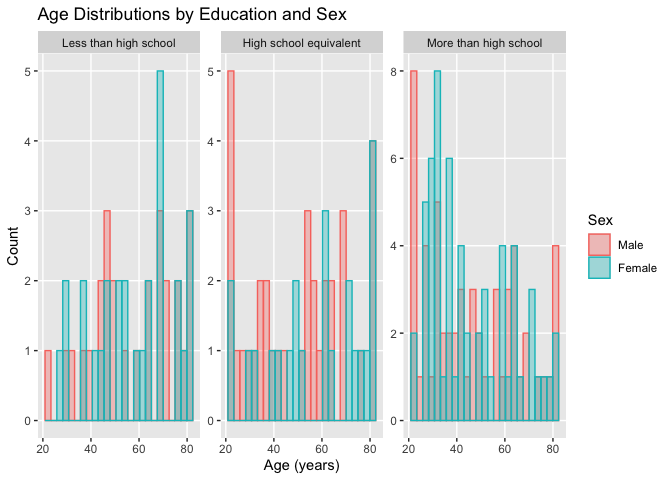
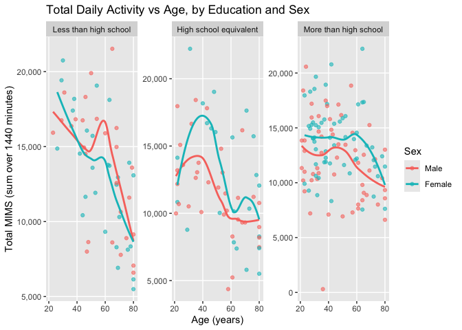
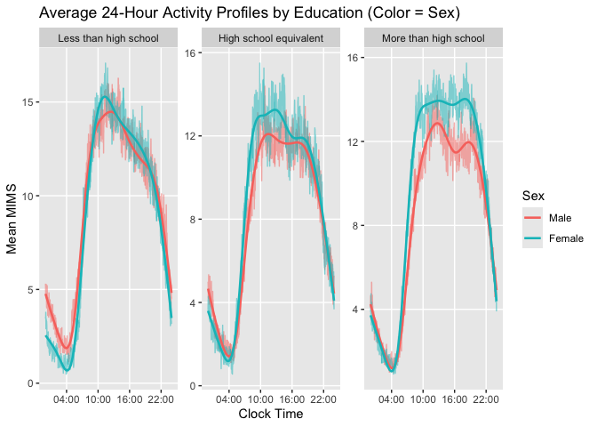

Homework 3 sc5558
================
Shiyun Angel Cheng

## Problem 0

``` r
library(tidyverse)
```

    ## ── Attaching core tidyverse packages ──────────────────────── tidyverse 2.0.0 ──
    ## ✔ dplyr     1.1.4     ✔ readr     2.1.5
    ## ✔ forcats   1.0.0     ✔ stringr   1.5.1
    ## ✔ ggplot2   3.5.2     ✔ tibble    3.3.0
    ## ✔ lubridate 1.9.4     ✔ tidyr     1.3.1
    ## ✔ purrr     1.1.0     
    ## ── Conflicts ────────────────────────────────────────── tidyverse_conflicts() ──
    ## ✖ dplyr::filter() masks stats::filter()
    ## ✖ dplyr::lag()    masks stats::lag()
    ## ℹ Use the conflicted package (<http://conflicted.r-lib.org/>) to force all conflicts to become errors

``` r
library(janitor)
```

    ## 
    ## Attaching package: 'janitor'
    ## 
    ## The following objects are masked from 'package:stats':
    ## 
    ##     chisq.test, fisher.test

``` r
library(lubridate)
library(gt)
library(patchwork)
library(scales)
```

    ## 
    ## Attaching package: 'scales'
    ## 
    ## The following object is masked from 'package:purrr':
    ## 
    ##     discard
    ## 
    ## The following object is masked from 'package:readr':
    ## 
    ##     col_factor

## Problem 1

This problem uses the Instacart data. DO NOT include this dataset in
your local data directory; instead, load the data from the
p8105.datasets using:

``` r
library(p8105.datasets)
data("instacart")
```

The goal is to do some exploration of this dataset. To that end, write a
short description of the dataset, noting the size and structure of the
data, describing some key variables, and giving illstrative examples of
observations.

Now I am conducting an initial exploraion of the dataset

``` r
instacart = instacart |>
  janitor::clean_names()

instacart |> glimpse()
```

    ## Rows: 1,384,617
    ## Columns: 15
    ## $ order_id               <int> 1, 1, 1, 1, 1, 1, 1, 1, 36, 36, 36, 36, 36, 36,…
    ## $ product_id             <int> 49302, 11109, 10246, 49683, 43633, 13176, 47209…
    ## $ add_to_cart_order      <int> 1, 2, 3, 4, 5, 6, 7, 8, 1, 2, 3, 4, 5, 6, 7, 8,…
    ## $ reordered              <int> 1, 1, 0, 0, 1, 0, 0, 1, 0, 1, 0, 1, 1, 1, 1, 1,…
    ## $ user_id                <int> 112108, 112108, 112108, 112108, 112108, 112108,…
    ## $ eval_set               <chr> "train", "train", "train", "train", "train", "t…
    ## $ order_number           <int> 4, 4, 4, 4, 4, 4, 4, 4, 23, 23, 23, 23, 23, 23,…
    ## $ order_dow              <int> 4, 4, 4, 4, 4, 4, 4, 4, 6, 6, 6, 6, 6, 6, 6, 6,…
    ## $ order_hour_of_day      <int> 10, 10, 10, 10, 10, 10, 10, 10, 18, 18, 18, 18,…
    ## $ days_since_prior_order <int> 9, 9, 9, 9, 9, 9, 9, 9, 30, 30, 30, 30, 30, 30,…
    ## $ product_name           <chr> "Bulgarian Yogurt", "Organic 4% Milk Fat Whole …
    ## $ aisle_id               <int> 120, 108, 83, 83, 95, 24, 24, 21, 2, 115, 53, 1…
    ## $ department_id          <int> 16, 16, 4, 4, 15, 4, 4, 16, 16, 7, 16, 4, 16, 2…
    ## $ aisle                  <chr> "yogurt", "other creams cheeses", "fresh vegeta…
    ## $ department             <chr> "dairy eggs", "dairy eggs", "produce", "produce…

This dataset contains grocery orders from Instacart. Each observation
represents a single product purchased by a user in a single order. The
dataset has 1384617 observations and 15 variables. Key variables
include:

product_name, aisle, and department: describe the purchased product;

order_hour_of_day and order_dow: describe when the order was placed;

add_to_cart_order and reordered: describe the user’s shopping behavior.

Now we move on to answering the following quesitons: 1. How many aisles
are there, and which aisles are the most items ordered from?

``` r
aisle_counts = instacart |>
  count(aisle, name = "n_items") |>
  arrange(desc(n_items))

n_aisles = nrow(aisle_counts)
top_aisles = aisle_counts |> slice_max(n_items, n = 5)

n_aisles
```

    ## [1] 134

There are 134 aisles in total. The top 5 aisles by number of items
ordered are below:

``` r
top_aisles |>
  gt() |>
  cols_label(
    aisle = "Aisle",
    n_items = "Items ordered"
  ) |>
  tab_header(title = "Top 5 Aisles by Items Ordered")
```

<div id="zcbsywbtqe" style="padding-left:0px;padding-right:0px;padding-top:10px;padding-bottom:10px;overflow-x:auto;overflow-y:auto;width:auto;height:auto;">
<style>#zcbsywbtqe table {
  font-family: system-ui, 'Segoe UI', Roboto, Helvetica, Arial, sans-serif, 'Apple Color Emoji', 'Segoe UI Emoji', 'Segoe UI Symbol', 'Noto Color Emoji';
  -webkit-font-smoothing: antialiased;
  -moz-osx-font-smoothing: grayscale;
}
&#10;#zcbsywbtqe thead, #zcbsywbtqe tbody, #zcbsywbtqe tfoot, #zcbsywbtqe tr, #zcbsywbtqe td, #zcbsywbtqe th {
  border-style: none;
}
&#10;#zcbsywbtqe p {
  margin: 0;
  padding: 0;
}
&#10;#zcbsywbtqe .gt_table {
  display: table;
  border-collapse: collapse;
  line-height: normal;
  margin-left: auto;
  margin-right: auto;
  color: #333333;
  font-size: 16px;
  font-weight: normal;
  font-style: normal;
  background-color: #FFFFFF;
  width: auto;
  border-top-style: solid;
  border-top-width: 2px;
  border-top-color: #A8A8A8;
  border-right-style: none;
  border-right-width: 2px;
  border-right-color: #D3D3D3;
  border-bottom-style: solid;
  border-bottom-width: 2px;
  border-bottom-color: #A8A8A8;
  border-left-style: none;
  border-left-width: 2px;
  border-left-color: #D3D3D3;
}
&#10;#zcbsywbtqe .gt_caption {
  padding-top: 4px;
  padding-bottom: 4px;
}
&#10;#zcbsywbtqe .gt_title {
  color: #333333;
  font-size: 125%;
  font-weight: initial;
  padding-top: 4px;
  padding-bottom: 4px;
  padding-left: 5px;
  padding-right: 5px;
  border-bottom-color: #FFFFFF;
  border-bottom-width: 0;
}
&#10;#zcbsywbtqe .gt_subtitle {
  color: #333333;
  font-size: 85%;
  font-weight: initial;
  padding-top: 3px;
  padding-bottom: 5px;
  padding-left: 5px;
  padding-right: 5px;
  border-top-color: #FFFFFF;
  border-top-width: 0;
}
&#10;#zcbsywbtqe .gt_heading {
  background-color: #FFFFFF;
  text-align: center;
  border-bottom-color: #FFFFFF;
  border-left-style: none;
  border-left-width: 1px;
  border-left-color: #D3D3D3;
  border-right-style: none;
  border-right-width: 1px;
  border-right-color: #D3D3D3;
}
&#10;#zcbsywbtqe .gt_bottom_border {
  border-bottom-style: solid;
  border-bottom-width: 2px;
  border-bottom-color: #D3D3D3;
}
&#10;#zcbsywbtqe .gt_col_headings {
  border-top-style: solid;
  border-top-width: 2px;
  border-top-color: #D3D3D3;
  border-bottom-style: solid;
  border-bottom-width: 2px;
  border-bottom-color: #D3D3D3;
  border-left-style: none;
  border-left-width: 1px;
  border-left-color: #D3D3D3;
  border-right-style: none;
  border-right-width: 1px;
  border-right-color: #D3D3D3;
}
&#10;#zcbsywbtqe .gt_col_heading {
  color: #333333;
  background-color: #FFFFFF;
  font-size: 100%;
  font-weight: normal;
  text-transform: inherit;
  border-left-style: none;
  border-left-width: 1px;
  border-left-color: #D3D3D3;
  border-right-style: none;
  border-right-width: 1px;
  border-right-color: #D3D3D3;
  vertical-align: bottom;
  padding-top: 5px;
  padding-bottom: 6px;
  padding-left: 5px;
  padding-right: 5px;
  overflow-x: hidden;
}
&#10;#zcbsywbtqe .gt_column_spanner_outer {
  color: #333333;
  background-color: #FFFFFF;
  font-size: 100%;
  font-weight: normal;
  text-transform: inherit;
  padding-top: 0;
  padding-bottom: 0;
  padding-left: 4px;
  padding-right: 4px;
}
&#10;#zcbsywbtqe .gt_column_spanner_outer:first-child {
  padding-left: 0;
}
&#10;#zcbsywbtqe .gt_column_spanner_outer:last-child {
  padding-right: 0;
}
&#10;#zcbsywbtqe .gt_column_spanner {
  border-bottom-style: solid;
  border-bottom-width: 2px;
  border-bottom-color: #D3D3D3;
  vertical-align: bottom;
  padding-top: 5px;
  padding-bottom: 5px;
  overflow-x: hidden;
  display: inline-block;
  width: 100%;
}
&#10;#zcbsywbtqe .gt_spanner_row {
  border-bottom-style: hidden;
}
&#10;#zcbsywbtqe .gt_group_heading {
  padding-top: 8px;
  padding-bottom: 8px;
  padding-left: 5px;
  padding-right: 5px;
  color: #333333;
  background-color: #FFFFFF;
  font-size: 100%;
  font-weight: initial;
  text-transform: inherit;
  border-top-style: solid;
  border-top-width: 2px;
  border-top-color: #D3D3D3;
  border-bottom-style: solid;
  border-bottom-width: 2px;
  border-bottom-color: #D3D3D3;
  border-left-style: none;
  border-left-width: 1px;
  border-left-color: #D3D3D3;
  border-right-style: none;
  border-right-width: 1px;
  border-right-color: #D3D3D3;
  vertical-align: middle;
  text-align: left;
}
&#10;#zcbsywbtqe .gt_empty_group_heading {
  padding: 0.5px;
  color: #333333;
  background-color: #FFFFFF;
  font-size: 100%;
  font-weight: initial;
  border-top-style: solid;
  border-top-width: 2px;
  border-top-color: #D3D3D3;
  border-bottom-style: solid;
  border-bottom-width: 2px;
  border-bottom-color: #D3D3D3;
  vertical-align: middle;
}
&#10;#zcbsywbtqe .gt_from_md > :first-child {
  margin-top: 0;
}
&#10;#zcbsywbtqe .gt_from_md > :last-child {
  margin-bottom: 0;
}
&#10;#zcbsywbtqe .gt_row {
  padding-top: 8px;
  padding-bottom: 8px;
  padding-left: 5px;
  padding-right: 5px;
  margin: 10px;
  border-top-style: solid;
  border-top-width: 1px;
  border-top-color: #D3D3D3;
  border-left-style: none;
  border-left-width: 1px;
  border-left-color: #D3D3D3;
  border-right-style: none;
  border-right-width: 1px;
  border-right-color: #D3D3D3;
  vertical-align: middle;
  overflow-x: hidden;
}
&#10;#zcbsywbtqe .gt_stub {
  color: #333333;
  background-color: #FFFFFF;
  font-size: 100%;
  font-weight: initial;
  text-transform: inherit;
  border-right-style: solid;
  border-right-width: 2px;
  border-right-color: #D3D3D3;
  padding-left: 5px;
  padding-right: 5px;
}
&#10;#zcbsywbtqe .gt_stub_row_group {
  color: #333333;
  background-color: #FFFFFF;
  font-size: 100%;
  font-weight: initial;
  text-transform: inherit;
  border-right-style: solid;
  border-right-width: 2px;
  border-right-color: #D3D3D3;
  padding-left: 5px;
  padding-right: 5px;
  vertical-align: top;
}
&#10;#zcbsywbtqe .gt_row_group_first td {
  border-top-width: 2px;
}
&#10;#zcbsywbtqe .gt_row_group_first th {
  border-top-width: 2px;
}
&#10;#zcbsywbtqe .gt_summary_row {
  color: #333333;
  background-color: #FFFFFF;
  text-transform: inherit;
  padding-top: 8px;
  padding-bottom: 8px;
  padding-left: 5px;
  padding-right: 5px;
}
&#10;#zcbsywbtqe .gt_first_summary_row {
  border-top-style: solid;
  border-top-color: #D3D3D3;
}
&#10;#zcbsywbtqe .gt_first_summary_row.thick {
  border-top-width: 2px;
}
&#10;#zcbsywbtqe .gt_last_summary_row {
  padding-top: 8px;
  padding-bottom: 8px;
  padding-left: 5px;
  padding-right: 5px;
  border-bottom-style: solid;
  border-bottom-width: 2px;
  border-bottom-color: #D3D3D3;
}
&#10;#zcbsywbtqe .gt_grand_summary_row {
  color: #333333;
  background-color: #FFFFFF;
  text-transform: inherit;
  padding-top: 8px;
  padding-bottom: 8px;
  padding-left: 5px;
  padding-right: 5px;
}
&#10;#zcbsywbtqe .gt_first_grand_summary_row {
  padding-top: 8px;
  padding-bottom: 8px;
  padding-left: 5px;
  padding-right: 5px;
  border-top-style: double;
  border-top-width: 6px;
  border-top-color: #D3D3D3;
}
&#10;#zcbsywbtqe .gt_last_grand_summary_row_top {
  padding-top: 8px;
  padding-bottom: 8px;
  padding-left: 5px;
  padding-right: 5px;
  border-bottom-style: double;
  border-bottom-width: 6px;
  border-bottom-color: #D3D3D3;
}
&#10;#zcbsywbtqe .gt_striped {
  background-color: rgba(128, 128, 128, 0.05);
}
&#10;#zcbsywbtqe .gt_table_body {
  border-top-style: solid;
  border-top-width: 2px;
  border-top-color: #D3D3D3;
  border-bottom-style: solid;
  border-bottom-width: 2px;
  border-bottom-color: #D3D3D3;
}
&#10;#zcbsywbtqe .gt_footnotes {
  color: #333333;
  background-color: #FFFFFF;
  border-bottom-style: none;
  border-bottom-width: 2px;
  border-bottom-color: #D3D3D3;
  border-left-style: none;
  border-left-width: 2px;
  border-left-color: #D3D3D3;
  border-right-style: none;
  border-right-width: 2px;
  border-right-color: #D3D3D3;
}
&#10;#zcbsywbtqe .gt_footnote {
  margin: 0px;
  font-size: 90%;
  padding-top: 4px;
  padding-bottom: 4px;
  padding-left: 5px;
  padding-right: 5px;
}
&#10;#zcbsywbtqe .gt_sourcenotes {
  color: #333333;
  background-color: #FFFFFF;
  border-bottom-style: none;
  border-bottom-width: 2px;
  border-bottom-color: #D3D3D3;
  border-left-style: none;
  border-left-width: 2px;
  border-left-color: #D3D3D3;
  border-right-style: none;
  border-right-width: 2px;
  border-right-color: #D3D3D3;
}
&#10;#zcbsywbtqe .gt_sourcenote {
  font-size: 90%;
  padding-top: 4px;
  padding-bottom: 4px;
  padding-left: 5px;
  padding-right: 5px;
}
&#10;#zcbsywbtqe .gt_left {
  text-align: left;
}
&#10;#zcbsywbtqe .gt_center {
  text-align: center;
}
&#10;#zcbsywbtqe .gt_right {
  text-align: right;
  font-variant-numeric: tabular-nums;
}
&#10;#zcbsywbtqe .gt_font_normal {
  font-weight: normal;
}
&#10;#zcbsywbtqe .gt_font_bold {
  font-weight: bold;
}
&#10;#zcbsywbtqe .gt_font_italic {
  font-style: italic;
}
&#10;#zcbsywbtqe .gt_super {
  font-size: 65%;
}
&#10;#zcbsywbtqe .gt_footnote_marks {
  font-size: 75%;
  vertical-align: 0.4em;
  position: initial;
}
&#10;#zcbsywbtqe .gt_asterisk {
  font-size: 100%;
  vertical-align: 0;
}
&#10;#zcbsywbtqe .gt_indent_1 {
  text-indent: 5px;
}
&#10;#zcbsywbtqe .gt_indent_2 {
  text-indent: 10px;
}
&#10;#zcbsywbtqe .gt_indent_3 {
  text-indent: 15px;
}
&#10;#zcbsywbtqe .gt_indent_4 {
  text-indent: 20px;
}
&#10;#zcbsywbtqe .gt_indent_5 {
  text-indent: 25px;
}
&#10;#zcbsywbtqe .katex-display {
  display: inline-flex !important;
  margin-bottom: 0.75em !important;
}
&#10;#zcbsywbtqe div.Reactable > div.rt-table > div.rt-thead > div.rt-tr.rt-tr-group-header > div.rt-th-group:after {
  height: 0px !important;
}
</style>
<table class="gt_table" data-quarto-disable-processing="false" data-quarto-bootstrap="false">
  <thead>
    <tr class="gt_heading">
      <td colspan="2" class="gt_heading gt_title gt_font_normal gt_bottom_border" style>Top 5 Aisles by Items Ordered</td>
    </tr>
    &#10;    <tr class="gt_col_headings">
      <th class="gt_col_heading gt_columns_bottom_border gt_left" rowspan="1" colspan="1" scope="col" id="aisle">Aisle</th>
      <th class="gt_col_heading gt_columns_bottom_border gt_right" rowspan="1" colspan="1" scope="col" id="n_items">Items ordered</th>
    </tr>
  </thead>
  <tbody class="gt_table_body">
    <tr><td headers="aisle" class="gt_row gt_left">fresh vegetables</td>
<td headers="n_items" class="gt_row gt_right">150609</td></tr>
    <tr><td headers="aisle" class="gt_row gt_left">fresh fruits</td>
<td headers="n_items" class="gt_row gt_right">150473</td></tr>
    <tr><td headers="aisle" class="gt_row gt_left">packaged vegetables fruits</td>
<td headers="n_items" class="gt_row gt_right">78493</td></tr>
    <tr><td headers="aisle" class="gt_row gt_left">yogurt</td>
<td headers="n_items" class="gt_row gt_right">55240</td></tr>
    <tr><td headers="aisle" class="gt_row gt_left">packaged cheese</td>
<td headers="n_items" class="gt_row gt_right">41699</td></tr>
  </tbody>
  &#10;</table>
</div>

2.  Make a plot that shows the number of items ordered in each aisle,
    limiting this to aisles with more than 10000 items ordered. Arrange
    aisles sensibly, and organize your plot so others can read it.

``` r
instacart |>
  count(aisle, name = "n_items") |>
  filter(n_items > 10000) |>
  mutate(aisle = fct_reorder(aisle, n_items)) |>
  ggplot(aes(x = aisle, y = n_items)) +
  geom_col(fill = "steelblue") +
  coord_flip() +
  labs(
    title = "Aisles with More Than 10,000 Items Ordered",
    x = NULL,
    y = "Items ordered"
  ) +
  theme_minimal()
```

<!-- -->
This plot emphasizes that fresh produce and dairy products are ordered
most.

3.  Make a table showing the three most popular items in each of the
    aisles “baking ingredients”, “dog food care”, and “packaged
    vegetables fruits”. Include the number of times each item is ordered
    in your table.

``` r
selected_aisles = c("baking ingredients", "dog food care", "packaged vegetables fruits")

instacart |>
  filter(aisle %in% selected_aisles) |>
  count(aisle, product_name, name = "n") |>
  group_by(aisle) |>
  slice_max(n, n = 3) |>
  ungroup() |>
  arrange(aisle, desc(n)) |>
  gt(groupname_col = "aisle") |>
  cols_label(
    product_name = "Product",
    n = "Times ordered"
  ) |>
  tab_header(title = "Top 3 Products in Selected Aisles")
```

<div id="rqiltlpmgj" style="padding-left:0px;padding-right:0px;padding-top:10px;padding-bottom:10px;overflow-x:auto;overflow-y:auto;width:auto;height:auto;">
<style>#rqiltlpmgj table {
  font-family: system-ui, 'Segoe UI', Roboto, Helvetica, Arial, sans-serif, 'Apple Color Emoji', 'Segoe UI Emoji', 'Segoe UI Symbol', 'Noto Color Emoji';
  -webkit-font-smoothing: antialiased;
  -moz-osx-font-smoothing: grayscale;
}
&#10;#rqiltlpmgj thead, #rqiltlpmgj tbody, #rqiltlpmgj tfoot, #rqiltlpmgj tr, #rqiltlpmgj td, #rqiltlpmgj th {
  border-style: none;
}
&#10;#rqiltlpmgj p {
  margin: 0;
  padding: 0;
}
&#10;#rqiltlpmgj .gt_table {
  display: table;
  border-collapse: collapse;
  line-height: normal;
  margin-left: auto;
  margin-right: auto;
  color: #333333;
  font-size: 16px;
  font-weight: normal;
  font-style: normal;
  background-color: #FFFFFF;
  width: auto;
  border-top-style: solid;
  border-top-width: 2px;
  border-top-color: #A8A8A8;
  border-right-style: none;
  border-right-width: 2px;
  border-right-color: #D3D3D3;
  border-bottom-style: solid;
  border-bottom-width: 2px;
  border-bottom-color: #A8A8A8;
  border-left-style: none;
  border-left-width: 2px;
  border-left-color: #D3D3D3;
}
&#10;#rqiltlpmgj .gt_caption {
  padding-top: 4px;
  padding-bottom: 4px;
}
&#10;#rqiltlpmgj .gt_title {
  color: #333333;
  font-size: 125%;
  font-weight: initial;
  padding-top: 4px;
  padding-bottom: 4px;
  padding-left: 5px;
  padding-right: 5px;
  border-bottom-color: #FFFFFF;
  border-bottom-width: 0;
}
&#10;#rqiltlpmgj .gt_subtitle {
  color: #333333;
  font-size: 85%;
  font-weight: initial;
  padding-top: 3px;
  padding-bottom: 5px;
  padding-left: 5px;
  padding-right: 5px;
  border-top-color: #FFFFFF;
  border-top-width: 0;
}
&#10;#rqiltlpmgj .gt_heading {
  background-color: #FFFFFF;
  text-align: center;
  border-bottom-color: #FFFFFF;
  border-left-style: none;
  border-left-width: 1px;
  border-left-color: #D3D3D3;
  border-right-style: none;
  border-right-width: 1px;
  border-right-color: #D3D3D3;
}
&#10;#rqiltlpmgj .gt_bottom_border {
  border-bottom-style: solid;
  border-bottom-width: 2px;
  border-bottom-color: #D3D3D3;
}
&#10;#rqiltlpmgj .gt_col_headings {
  border-top-style: solid;
  border-top-width: 2px;
  border-top-color: #D3D3D3;
  border-bottom-style: solid;
  border-bottom-width: 2px;
  border-bottom-color: #D3D3D3;
  border-left-style: none;
  border-left-width: 1px;
  border-left-color: #D3D3D3;
  border-right-style: none;
  border-right-width: 1px;
  border-right-color: #D3D3D3;
}
&#10;#rqiltlpmgj .gt_col_heading {
  color: #333333;
  background-color: #FFFFFF;
  font-size: 100%;
  font-weight: normal;
  text-transform: inherit;
  border-left-style: none;
  border-left-width: 1px;
  border-left-color: #D3D3D3;
  border-right-style: none;
  border-right-width: 1px;
  border-right-color: #D3D3D3;
  vertical-align: bottom;
  padding-top: 5px;
  padding-bottom: 6px;
  padding-left: 5px;
  padding-right: 5px;
  overflow-x: hidden;
}
&#10;#rqiltlpmgj .gt_column_spanner_outer {
  color: #333333;
  background-color: #FFFFFF;
  font-size: 100%;
  font-weight: normal;
  text-transform: inherit;
  padding-top: 0;
  padding-bottom: 0;
  padding-left: 4px;
  padding-right: 4px;
}
&#10;#rqiltlpmgj .gt_column_spanner_outer:first-child {
  padding-left: 0;
}
&#10;#rqiltlpmgj .gt_column_spanner_outer:last-child {
  padding-right: 0;
}
&#10;#rqiltlpmgj .gt_column_spanner {
  border-bottom-style: solid;
  border-bottom-width: 2px;
  border-bottom-color: #D3D3D3;
  vertical-align: bottom;
  padding-top: 5px;
  padding-bottom: 5px;
  overflow-x: hidden;
  display: inline-block;
  width: 100%;
}
&#10;#rqiltlpmgj .gt_spanner_row {
  border-bottom-style: hidden;
}
&#10;#rqiltlpmgj .gt_group_heading {
  padding-top: 8px;
  padding-bottom: 8px;
  padding-left: 5px;
  padding-right: 5px;
  color: #333333;
  background-color: #FFFFFF;
  font-size: 100%;
  font-weight: initial;
  text-transform: inherit;
  border-top-style: solid;
  border-top-width: 2px;
  border-top-color: #D3D3D3;
  border-bottom-style: solid;
  border-bottom-width: 2px;
  border-bottom-color: #D3D3D3;
  border-left-style: none;
  border-left-width: 1px;
  border-left-color: #D3D3D3;
  border-right-style: none;
  border-right-width: 1px;
  border-right-color: #D3D3D3;
  vertical-align: middle;
  text-align: left;
}
&#10;#rqiltlpmgj .gt_empty_group_heading {
  padding: 0.5px;
  color: #333333;
  background-color: #FFFFFF;
  font-size: 100%;
  font-weight: initial;
  border-top-style: solid;
  border-top-width: 2px;
  border-top-color: #D3D3D3;
  border-bottom-style: solid;
  border-bottom-width: 2px;
  border-bottom-color: #D3D3D3;
  vertical-align: middle;
}
&#10;#rqiltlpmgj .gt_from_md > :first-child {
  margin-top: 0;
}
&#10;#rqiltlpmgj .gt_from_md > :last-child {
  margin-bottom: 0;
}
&#10;#rqiltlpmgj .gt_row {
  padding-top: 8px;
  padding-bottom: 8px;
  padding-left: 5px;
  padding-right: 5px;
  margin: 10px;
  border-top-style: solid;
  border-top-width: 1px;
  border-top-color: #D3D3D3;
  border-left-style: none;
  border-left-width: 1px;
  border-left-color: #D3D3D3;
  border-right-style: none;
  border-right-width: 1px;
  border-right-color: #D3D3D3;
  vertical-align: middle;
  overflow-x: hidden;
}
&#10;#rqiltlpmgj .gt_stub {
  color: #333333;
  background-color: #FFFFFF;
  font-size: 100%;
  font-weight: initial;
  text-transform: inherit;
  border-right-style: solid;
  border-right-width: 2px;
  border-right-color: #D3D3D3;
  padding-left: 5px;
  padding-right: 5px;
}
&#10;#rqiltlpmgj .gt_stub_row_group {
  color: #333333;
  background-color: #FFFFFF;
  font-size: 100%;
  font-weight: initial;
  text-transform: inherit;
  border-right-style: solid;
  border-right-width: 2px;
  border-right-color: #D3D3D3;
  padding-left: 5px;
  padding-right: 5px;
  vertical-align: top;
}
&#10;#rqiltlpmgj .gt_row_group_first td {
  border-top-width: 2px;
}
&#10;#rqiltlpmgj .gt_row_group_first th {
  border-top-width: 2px;
}
&#10;#rqiltlpmgj .gt_summary_row {
  color: #333333;
  background-color: #FFFFFF;
  text-transform: inherit;
  padding-top: 8px;
  padding-bottom: 8px;
  padding-left: 5px;
  padding-right: 5px;
}
&#10;#rqiltlpmgj .gt_first_summary_row {
  border-top-style: solid;
  border-top-color: #D3D3D3;
}
&#10;#rqiltlpmgj .gt_first_summary_row.thick {
  border-top-width: 2px;
}
&#10;#rqiltlpmgj .gt_last_summary_row {
  padding-top: 8px;
  padding-bottom: 8px;
  padding-left: 5px;
  padding-right: 5px;
  border-bottom-style: solid;
  border-bottom-width: 2px;
  border-bottom-color: #D3D3D3;
}
&#10;#rqiltlpmgj .gt_grand_summary_row {
  color: #333333;
  background-color: #FFFFFF;
  text-transform: inherit;
  padding-top: 8px;
  padding-bottom: 8px;
  padding-left: 5px;
  padding-right: 5px;
}
&#10;#rqiltlpmgj .gt_first_grand_summary_row {
  padding-top: 8px;
  padding-bottom: 8px;
  padding-left: 5px;
  padding-right: 5px;
  border-top-style: double;
  border-top-width: 6px;
  border-top-color: #D3D3D3;
}
&#10;#rqiltlpmgj .gt_last_grand_summary_row_top {
  padding-top: 8px;
  padding-bottom: 8px;
  padding-left: 5px;
  padding-right: 5px;
  border-bottom-style: double;
  border-bottom-width: 6px;
  border-bottom-color: #D3D3D3;
}
&#10;#rqiltlpmgj .gt_striped {
  background-color: rgba(128, 128, 128, 0.05);
}
&#10;#rqiltlpmgj .gt_table_body {
  border-top-style: solid;
  border-top-width: 2px;
  border-top-color: #D3D3D3;
  border-bottom-style: solid;
  border-bottom-width: 2px;
  border-bottom-color: #D3D3D3;
}
&#10;#rqiltlpmgj .gt_footnotes {
  color: #333333;
  background-color: #FFFFFF;
  border-bottom-style: none;
  border-bottom-width: 2px;
  border-bottom-color: #D3D3D3;
  border-left-style: none;
  border-left-width: 2px;
  border-left-color: #D3D3D3;
  border-right-style: none;
  border-right-width: 2px;
  border-right-color: #D3D3D3;
}
&#10;#rqiltlpmgj .gt_footnote {
  margin: 0px;
  font-size: 90%;
  padding-top: 4px;
  padding-bottom: 4px;
  padding-left: 5px;
  padding-right: 5px;
}
&#10;#rqiltlpmgj .gt_sourcenotes {
  color: #333333;
  background-color: #FFFFFF;
  border-bottom-style: none;
  border-bottom-width: 2px;
  border-bottom-color: #D3D3D3;
  border-left-style: none;
  border-left-width: 2px;
  border-left-color: #D3D3D3;
  border-right-style: none;
  border-right-width: 2px;
  border-right-color: #D3D3D3;
}
&#10;#rqiltlpmgj .gt_sourcenote {
  font-size: 90%;
  padding-top: 4px;
  padding-bottom: 4px;
  padding-left: 5px;
  padding-right: 5px;
}
&#10;#rqiltlpmgj .gt_left {
  text-align: left;
}
&#10;#rqiltlpmgj .gt_center {
  text-align: center;
}
&#10;#rqiltlpmgj .gt_right {
  text-align: right;
  font-variant-numeric: tabular-nums;
}
&#10;#rqiltlpmgj .gt_font_normal {
  font-weight: normal;
}
&#10;#rqiltlpmgj .gt_font_bold {
  font-weight: bold;
}
&#10;#rqiltlpmgj .gt_font_italic {
  font-style: italic;
}
&#10;#rqiltlpmgj .gt_super {
  font-size: 65%;
}
&#10;#rqiltlpmgj .gt_footnote_marks {
  font-size: 75%;
  vertical-align: 0.4em;
  position: initial;
}
&#10;#rqiltlpmgj .gt_asterisk {
  font-size: 100%;
  vertical-align: 0;
}
&#10;#rqiltlpmgj .gt_indent_1 {
  text-indent: 5px;
}
&#10;#rqiltlpmgj .gt_indent_2 {
  text-indent: 10px;
}
&#10;#rqiltlpmgj .gt_indent_3 {
  text-indent: 15px;
}
&#10;#rqiltlpmgj .gt_indent_4 {
  text-indent: 20px;
}
&#10;#rqiltlpmgj .gt_indent_5 {
  text-indent: 25px;
}
&#10;#rqiltlpmgj .katex-display {
  display: inline-flex !important;
  margin-bottom: 0.75em !important;
}
&#10;#rqiltlpmgj div.Reactable > div.rt-table > div.rt-thead > div.rt-tr.rt-tr-group-header > div.rt-th-group:after {
  height: 0px !important;
}
</style>
<table class="gt_table" data-quarto-disable-processing="false" data-quarto-bootstrap="false">
  <thead>
    <tr class="gt_heading">
      <td colspan="2" class="gt_heading gt_title gt_font_normal gt_bottom_border" style>Top 3 Products in Selected Aisles</td>
    </tr>
    &#10;    <tr class="gt_col_headings">
      <th class="gt_col_heading gt_columns_bottom_border gt_left" rowspan="1" colspan="1" scope="col" id="product_name">Product</th>
      <th class="gt_col_heading gt_columns_bottom_border gt_right" rowspan="1" colspan="1" scope="col" id="n">Times ordered</th>
    </tr>
  </thead>
  <tbody class="gt_table_body">
    <tr class="gt_group_heading_row">
      <th colspan="2" class="gt_group_heading" scope="colgroup" id="baking ingredients">baking ingredients</th>
    </tr>
    <tr class="gt_row_group_first"><td headers="baking ingredients  product_name" class="gt_row gt_left">Light Brown Sugar</td>
<td headers="baking ingredients  n" class="gt_row gt_right">499</td></tr>
    <tr><td headers="baking ingredients  product_name" class="gt_row gt_left">Pure Baking Soda</td>
<td headers="baking ingredients  n" class="gt_row gt_right">387</td></tr>
    <tr><td headers="baking ingredients  product_name" class="gt_row gt_left">Cane Sugar</td>
<td headers="baking ingredients  n" class="gt_row gt_right">336</td></tr>
    <tr class="gt_group_heading_row">
      <th colspan="2" class="gt_group_heading" scope="colgroup" id="dog food care">dog food care</th>
    </tr>
    <tr class="gt_row_group_first"><td headers="dog food care  product_name" class="gt_row gt_left">Snack Sticks Chicken &amp; Rice Recipe Dog Treats</td>
<td headers="dog food care  n" class="gt_row gt_right">30</td></tr>
    <tr><td headers="dog food care  product_name" class="gt_row gt_left">Organix Chicken &amp; Brown Rice Recipe</td>
<td headers="dog food care  n" class="gt_row gt_right">28</td></tr>
    <tr><td headers="dog food care  product_name" class="gt_row gt_left">Small Dog Biscuits</td>
<td headers="dog food care  n" class="gt_row gt_right">26</td></tr>
    <tr class="gt_group_heading_row">
      <th colspan="2" class="gt_group_heading" scope="colgroup" id="packaged vegetables fruits">packaged vegetables fruits</th>
    </tr>
    <tr class="gt_row_group_first"><td headers="packaged vegetables fruits  product_name" class="gt_row gt_left">Organic Baby Spinach</td>
<td headers="packaged vegetables fruits  n" class="gt_row gt_right">9784</td></tr>
    <tr><td headers="packaged vegetables fruits  product_name" class="gt_row gt_left">Organic Raspberries</td>
<td headers="packaged vegetables fruits  n" class="gt_row gt_right">5546</td></tr>
    <tr><td headers="packaged vegetables fruits  product_name" class="gt_row gt_left">Organic Blueberries</td>
<td headers="packaged vegetables fruits  n" class="gt_row gt_right">4966</td></tr>
  </tbody>
  &#10;</table>
</div>

Packaged vegetables fruits aisle are ordered most times, with baking
ingredients and dog food care following. For packaged vegetables fruits,
organic baby spinach and raspberries are ordered most.For baking
ingredients, brown sugar, baking soda, and cane sugar are ordered most.
For dog food care, dog treats, recipe, and dog biscuits are ordered
most.

4.  Make a table showing the mean hour of the day at which Pink Lady
    Apples and Coffee Ice Cream are ordered on each day of the week;
    format this table for human readers (i.e. produce a 2 x 7 table).

``` r
instacart |>
  filter(product_name %in% c("Pink Lady Apples", "Coffee Ice Cream")) |>
  group_by(product_name, order_dow) |>
  summarize(mean_hour = mean(order_hour_of_day), .groups = "drop") |>
  mutate(order_dow = factor(order_dow, levels = 0:6,
                            labels = c("Sun", "Mon", "Tue", "Wed", "Thu", "Fri", "Sat"))) |>
  pivot_wider(names_from = order_dow, values_from = mean_hour) |>
  gt(rowname_col = "product_name") |>
  fmt_number(everything(), decimals = 2) |>
  tab_header(title = "Mean Order Hour by Day of Week")
```

<div id="dqkvaibuwy" style="padding-left:0px;padding-right:0px;padding-top:10px;padding-bottom:10px;overflow-x:auto;overflow-y:auto;width:auto;height:auto;">
<style>#dqkvaibuwy table {
  font-family: system-ui, 'Segoe UI', Roboto, Helvetica, Arial, sans-serif, 'Apple Color Emoji', 'Segoe UI Emoji', 'Segoe UI Symbol', 'Noto Color Emoji';
  -webkit-font-smoothing: antialiased;
  -moz-osx-font-smoothing: grayscale;
}
&#10;#dqkvaibuwy thead, #dqkvaibuwy tbody, #dqkvaibuwy tfoot, #dqkvaibuwy tr, #dqkvaibuwy td, #dqkvaibuwy th {
  border-style: none;
}
&#10;#dqkvaibuwy p {
  margin: 0;
  padding: 0;
}
&#10;#dqkvaibuwy .gt_table {
  display: table;
  border-collapse: collapse;
  line-height: normal;
  margin-left: auto;
  margin-right: auto;
  color: #333333;
  font-size: 16px;
  font-weight: normal;
  font-style: normal;
  background-color: #FFFFFF;
  width: auto;
  border-top-style: solid;
  border-top-width: 2px;
  border-top-color: #A8A8A8;
  border-right-style: none;
  border-right-width: 2px;
  border-right-color: #D3D3D3;
  border-bottom-style: solid;
  border-bottom-width: 2px;
  border-bottom-color: #A8A8A8;
  border-left-style: none;
  border-left-width: 2px;
  border-left-color: #D3D3D3;
}
&#10;#dqkvaibuwy .gt_caption {
  padding-top: 4px;
  padding-bottom: 4px;
}
&#10;#dqkvaibuwy .gt_title {
  color: #333333;
  font-size: 125%;
  font-weight: initial;
  padding-top: 4px;
  padding-bottom: 4px;
  padding-left: 5px;
  padding-right: 5px;
  border-bottom-color: #FFFFFF;
  border-bottom-width: 0;
}
&#10;#dqkvaibuwy .gt_subtitle {
  color: #333333;
  font-size: 85%;
  font-weight: initial;
  padding-top: 3px;
  padding-bottom: 5px;
  padding-left: 5px;
  padding-right: 5px;
  border-top-color: #FFFFFF;
  border-top-width: 0;
}
&#10;#dqkvaibuwy .gt_heading {
  background-color: #FFFFFF;
  text-align: center;
  border-bottom-color: #FFFFFF;
  border-left-style: none;
  border-left-width: 1px;
  border-left-color: #D3D3D3;
  border-right-style: none;
  border-right-width: 1px;
  border-right-color: #D3D3D3;
}
&#10;#dqkvaibuwy .gt_bottom_border {
  border-bottom-style: solid;
  border-bottom-width: 2px;
  border-bottom-color: #D3D3D3;
}
&#10;#dqkvaibuwy .gt_col_headings {
  border-top-style: solid;
  border-top-width: 2px;
  border-top-color: #D3D3D3;
  border-bottom-style: solid;
  border-bottom-width: 2px;
  border-bottom-color: #D3D3D3;
  border-left-style: none;
  border-left-width: 1px;
  border-left-color: #D3D3D3;
  border-right-style: none;
  border-right-width: 1px;
  border-right-color: #D3D3D3;
}
&#10;#dqkvaibuwy .gt_col_heading {
  color: #333333;
  background-color: #FFFFFF;
  font-size: 100%;
  font-weight: normal;
  text-transform: inherit;
  border-left-style: none;
  border-left-width: 1px;
  border-left-color: #D3D3D3;
  border-right-style: none;
  border-right-width: 1px;
  border-right-color: #D3D3D3;
  vertical-align: bottom;
  padding-top: 5px;
  padding-bottom: 6px;
  padding-left: 5px;
  padding-right: 5px;
  overflow-x: hidden;
}
&#10;#dqkvaibuwy .gt_column_spanner_outer {
  color: #333333;
  background-color: #FFFFFF;
  font-size: 100%;
  font-weight: normal;
  text-transform: inherit;
  padding-top: 0;
  padding-bottom: 0;
  padding-left: 4px;
  padding-right: 4px;
}
&#10;#dqkvaibuwy .gt_column_spanner_outer:first-child {
  padding-left: 0;
}
&#10;#dqkvaibuwy .gt_column_spanner_outer:last-child {
  padding-right: 0;
}
&#10;#dqkvaibuwy .gt_column_spanner {
  border-bottom-style: solid;
  border-bottom-width: 2px;
  border-bottom-color: #D3D3D3;
  vertical-align: bottom;
  padding-top: 5px;
  padding-bottom: 5px;
  overflow-x: hidden;
  display: inline-block;
  width: 100%;
}
&#10;#dqkvaibuwy .gt_spanner_row {
  border-bottom-style: hidden;
}
&#10;#dqkvaibuwy .gt_group_heading {
  padding-top: 8px;
  padding-bottom: 8px;
  padding-left: 5px;
  padding-right: 5px;
  color: #333333;
  background-color: #FFFFFF;
  font-size: 100%;
  font-weight: initial;
  text-transform: inherit;
  border-top-style: solid;
  border-top-width: 2px;
  border-top-color: #D3D3D3;
  border-bottom-style: solid;
  border-bottom-width: 2px;
  border-bottom-color: #D3D3D3;
  border-left-style: none;
  border-left-width: 1px;
  border-left-color: #D3D3D3;
  border-right-style: none;
  border-right-width: 1px;
  border-right-color: #D3D3D3;
  vertical-align: middle;
  text-align: left;
}
&#10;#dqkvaibuwy .gt_empty_group_heading {
  padding: 0.5px;
  color: #333333;
  background-color: #FFFFFF;
  font-size: 100%;
  font-weight: initial;
  border-top-style: solid;
  border-top-width: 2px;
  border-top-color: #D3D3D3;
  border-bottom-style: solid;
  border-bottom-width: 2px;
  border-bottom-color: #D3D3D3;
  vertical-align: middle;
}
&#10;#dqkvaibuwy .gt_from_md > :first-child {
  margin-top: 0;
}
&#10;#dqkvaibuwy .gt_from_md > :last-child {
  margin-bottom: 0;
}
&#10;#dqkvaibuwy .gt_row {
  padding-top: 8px;
  padding-bottom: 8px;
  padding-left: 5px;
  padding-right: 5px;
  margin: 10px;
  border-top-style: solid;
  border-top-width: 1px;
  border-top-color: #D3D3D3;
  border-left-style: none;
  border-left-width: 1px;
  border-left-color: #D3D3D3;
  border-right-style: none;
  border-right-width: 1px;
  border-right-color: #D3D3D3;
  vertical-align: middle;
  overflow-x: hidden;
}
&#10;#dqkvaibuwy .gt_stub {
  color: #333333;
  background-color: #FFFFFF;
  font-size: 100%;
  font-weight: initial;
  text-transform: inherit;
  border-right-style: solid;
  border-right-width: 2px;
  border-right-color: #D3D3D3;
  padding-left: 5px;
  padding-right: 5px;
}
&#10;#dqkvaibuwy .gt_stub_row_group {
  color: #333333;
  background-color: #FFFFFF;
  font-size: 100%;
  font-weight: initial;
  text-transform: inherit;
  border-right-style: solid;
  border-right-width: 2px;
  border-right-color: #D3D3D3;
  padding-left: 5px;
  padding-right: 5px;
  vertical-align: top;
}
&#10;#dqkvaibuwy .gt_row_group_first td {
  border-top-width: 2px;
}
&#10;#dqkvaibuwy .gt_row_group_first th {
  border-top-width: 2px;
}
&#10;#dqkvaibuwy .gt_summary_row {
  color: #333333;
  background-color: #FFFFFF;
  text-transform: inherit;
  padding-top: 8px;
  padding-bottom: 8px;
  padding-left: 5px;
  padding-right: 5px;
}
&#10;#dqkvaibuwy .gt_first_summary_row {
  border-top-style: solid;
  border-top-color: #D3D3D3;
}
&#10;#dqkvaibuwy .gt_first_summary_row.thick {
  border-top-width: 2px;
}
&#10;#dqkvaibuwy .gt_last_summary_row {
  padding-top: 8px;
  padding-bottom: 8px;
  padding-left: 5px;
  padding-right: 5px;
  border-bottom-style: solid;
  border-bottom-width: 2px;
  border-bottom-color: #D3D3D3;
}
&#10;#dqkvaibuwy .gt_grand_summary_row {
  color: #333333;
  background-color: #FFFFFF;
  text-transform: inherit;
  padding-top: 8px;
  padding-bottom: 8px;
  padding-left: 5px;
  padding-right: 5px;
}
&#10;#dqkvaibuwy .gt_first_grand_summary_row {
  padding-top: 8px;
  padding-bottom: 8px;
  padding-left: 5px;
  padding-right: 5px;
  border-top-style: double;
  border-top-width: 6px;
  border-top-color: #D3D3D3;
}
&#10;#dqkvaibuwy .gt_last_grand_summary_row_top {
  padding-top: 8px;
  padding-bottom: 8px;
  padding-left: 5px;
  padding-right: 5px;
  border-bottom-style: double;
  border-bottom-width: 6px;
  border-bottom-color: #D3D3D3;
}
&#10;#dqkvaibuwy .gt_striped {
  background-color: rgba(128, 128, 128, 0.05);
}
&#10;#dqkvaibuwy .gt_table_body {
  border-top-style: solid;
  border-top-width: 2px;
  border-top-color: #D3D3D3;
  border-bottom-style: solid;
  border-bottom-width: 2px;
  border-bottom-color: #D3D3D3;
}
&#10;#dqkvaibuwy .gt_footnotes {
  color: #333333;
  background-color: #FFFFFF;
  border-bottom-style: none;
  border-bottom-width: 2px;
  border-bottom-color: #D3D3D3;
  border-left-style: none;
  border-left-width: 2px;
  border-left-color: #D3D3D3;
  border-right-style: none;
  border-right-width: 2px;
  border-right-color: #D3D3D3;
}
&#10;#dqkvaibuwy .gt_footnote {
  margin: 0px;
  font-size: 90%;
  padding-top: 4px;
  padding-bottom: 4px;
  padding-left: 5px;
  padding-right: 5px;
}
&#10;#dqkvaibuwy .gt_sourcenotes {
  color: #333333;
  background-color: #FFFFFF;
  border-bottom-style: none;
  border-bottom-width: 2px;
  border-bottom-color: #D3D3D3;
  border-left-style: none;
  border-left-width: 2px;
  border-left-color: #D3D3D3;
  border-right-style: none;
  border-right-width: 2px;
  border-right-color: #D3D3D3;
}
&#10;#dqkvaibuwy .gt_sourcenote {
  font-size: 90%;
  padding-top: 4px;
  padding-bottom: 4px;
  padding-left: 5px;
  padding-right: 5px;
}
&#10;#dqkvaibuwy .gt_left {
  text-align: left;
}
&#10;#dqkvaibuwy .gt_center {
  text-align: center;
}
&#10;#dqkvaibuwy .gt_right {
  text-align: right;
  font-variant-numeric: tabular-nums;
}
&#10;#dqkvaibuwy .gt_font_normal {
  font-weight: normal;
}
&#10;#dqkvaibuwy .gt_font_bold {
  font-weight: bold;
}
&#10;#dqkvaibuwy .gt_font_italic {
  font-style: italic;
}
&#10;#dqkvaibuwy .gt_super {
  font-size: 65%;
}
&#10;#dqkvaibuwy .gt_footnote_marks {
  font-size: 75%;
  vertical-align: 0.4em;
  position: initial;
}
&#10;#dqkvaibuwy .gt_asterisk {
  font-size: 100%;
  vertical-align: 0;
}
&#10;#dqkvaibuwy .gt_indent_1 {
  text-indent: 5px;
}
&#10;#dqkvaibuwy .gt_indent_2 {
  text-indent: 10px;
}
&#10;#dqkvaibuwy .gt_indent_3 {
  text-indent: 15px;
}
&#10;#dqkvaibuwy .gt_indent_4 {
  text-indent: 20px;
}
&#10;#dqkvaibuwy .gt_indent_5 {
  text-indent: 25px;
}
&#10;#dqkvaibuwy .katex-display {
  display: inline-flex !important;
  margin-bottom: 0.75em !important;
}
&#10;#dqkvaibuwy div.Reactable > div.rt-table > div.rt-thead > div.rt-tr.rt-tr-group-header > div.rt-th-group:after {
  height: 0px !important;
}
</style>
<table class="gt_table" data-quarto-disable-processing="false" data-quarto-bootstrap="false">
  <thead>
    <tr class="gt_heading">
      <td colspan="8" class="gt_heading gt_title gt_font_normal gt_bottom_border" style>Mean Order Hour by Day of Week</td>
    </tr>
    &#10;    <tr class="gt_col_headings">
      <th class="gt_col_heading gt_columns_bottom_border gt_left" rowspan="1" colspan="1" scope="col" id="a::stub"></th>
      <th class="gt_col_heading gt_columns_bottom_border gt_right" rowspan="1" colspan="1" scope="col" id="Sun">Sun</th>
      <th class="gt_col_heading gt_columns_bottom_border gt_right" rowspan="1" colspan="1" scope="col" id="Mon">Mon</th>
      <th class="gt_col_heading gt_columns_bottom_border gt_right" rowspan="1" colspan="1" scope="col" id="Tue">Tue</th>
      <th class="gt_col_heading gt_columns_bottom_border gt_right" rowspan="1" colspan="1" scope="col" id="Wed">Wed</th>
      <th class="gt_col_heading gt_columns_bottom_border gt_right" rowspan="1" colspan="1" scope="col" id="Thu">Thu</th>
      <th class="gt_col_heading gt_columns_bottom_border gt_right" rowspan="1" colspan="1" scope="col" id="Fri">Fri</th>
      <th class="gt_col_heading gt_columns_bottom_border gt_right" rowspan="1" colspan="1" scope="col" id="Sat">Sat</th>
    </tr>
  </thead>
  <tbody class="gt_table_body">
    <tr><th id="stub_1_1" scope="row" class="gt_row gt_left gt_stub">Coffee Ice Cream</th>
<td headers="stub_1_1 Sun" class="gt_row gt_right">13.77</td>
<td headers="stub_1_1 Mon" class="gt_row gt_right">14.32</td>
<td headers="stub_1_1 Tue" class="gt_row gt_right">15.38</td>
<td headers="stub_1_1 Wed" class="gt_row gt_right">15.32</td>
<td headers="stub_1_1 Thu" class="gt_row gt_right">15.22</td>
<td headers="stub_1_1 Fri" class="gt_row gt_right">12.26</td>
<td headers="stub_1_1 Sat" class="gt_row gt_right">13.83</td></tr>
    <tr><th id="stub_1_2" scope="row" class="gt_row gt_left gt_stub">Pink Lady Apples</th>
<td headers="stub_1_2 Sun" class="gt_row gt_right">13.44</td>
<td headers="stub_1_2 Mon" class="gt_row gt_right">11.36</td>
<td headers="stub_1_2 Tue" class="gt_row gt_right">11.70</td>
<td headers="stub_1_2 Wed" class="gt_row gt_right">14.25</td>
<td headers="stub_1_2 Thu" class="gt_row gt_right">11.55</td>
<td headers="stub_1_2 Fri" class="gt_row gt_right">12.78</td>
<td headers="stub_1_2 Sat" class="gt_row gt_right">11.94</td></tr>
  </tbody>
  &#10;</table>
</div>

This table shows that Pink Lady Apples are generally ordered earlier in
the day, while Coffee Ice Cream tends to be ordered slightly later.

### Problem 2

This Problem uses the Zillow datasets introduced in Homework 2. Both
datasets are available here. Import, clean, and otherwise tidy these
datasets.

``` r
# Import Zillow price data
zori_df = 
  read_csv("./data/zillow_data/Zip_zori_uc_sfrcondomfr_sm_month_NYC.csv") |> 
  pivot_longer(
    cols = matches("^20"),  # columns like "2015-01-31", etc.
    names_to = "month",
    values_to = "price"
  ) |> 
  janitor::clean_names() |> 
  rename(zip_code = region_name) |> 
  mutate(
    month = lubridate::ymd(month),
    year = lubridate::year(month),
    zip_code = as.numeric(zip_code)
  ) |> 
  select(-county_name)  # drop unused column
```

    ## Rows: 149 Columns: 125
    ## ── Column specification ────────────────────────────────────────────────────────
    ## Delimiter: ","
    ## chr   (6): RegionType, StateName, State, City, Metro, CountyName
    ## dbl (119): RegionID, SizeRank, RegionName, 2015-01-31, 2015-02-28, 2015-03-3...
    ## 
    ## ℹ Use `spec()` to retrieve the full column specification for this data.
    ## ℹ Specify the column types or set `show_col_types = FALSE` to quiet this message.

``` r
# Import and clean ZIP code → borough mapping
zipcode_df = 
  read_csv("./data/zillow_data/Zip Codes.csv") |> 
  janitor::clean_names() |> 
  filter(
    !(zip_code == 10463 & county == "New York"),
    !(zip_code == 11201 & county == "New York")
  ) |> 
  mutate(
    borough = dplyr::case_match(
      county,
      "Bronx" ~ "Bronx",
      "Kings" ~ "Brooklyn",
      "New York" ~ "Manhattan",
      "Queens" ~ "Queens",
      "Richmond" ~ "Staten Island"
    )
  ) |> 
  select(zip_code, borough, neighborhood)
```

    ## Rows: 322 Columns: 7
    ## ── Column specification ────────────────────────────────────────────────────────
    ## Delimiter: ","
    ## chr (4): County, County Code, File Date, Neighborhood
    ## dbl (3): State FIPS, County FIPS, ZipCode
    ## 
    ## ℹ Use `spec()` to retrieve the full column specification for this data.
    ## ℹ Specify the column types or set `show_col_types = FALSE` to quiet this message.

``` r
# Join datasets
nyc_price_df = 
  left_join(zori_df, zipcode_df, by = "zip_code")
```

There are 116 months between January 2015 and August 2024. How many ZIP
codes are observed 116 times? How many are observed fewer than 10 times?
Why are some ZIP codes are observed rarely and others observed in each
month?

``` r
zip_months_df = 
  nyc_price_df |>
  count(zip_code, name = "n_months")

n_full_coverage = zip_months_df |>
  filter(n_months == 116) |>
  nrow()

n_very_sparse = zip_months_df |>
  filter(n_months < 10) |>
  nrow()
```

There are 149 ZIP codes observed in all 116 months between January 2015
and August 2024. There are 0 ZIP codes observed fewer that 10 times.
Some ZIP codes are observed rarely maybe due to to these reasons: 1.
There are commercial or government buildings instead of residential
areas. 2. There are areas with insufficient rental market coverage.
However, our data shows that ZIps observed across all 116 months are
typically stable, residential zones with concsistent Zillow rental date
over time.

Create a reader-friendly table showing the average rental price in each
borough and year (not month). Comment on trends in this table.

``` r
borough_year_df = 
  nyc_price_df |>
  group_by(borough, year) |>
  summarize(mean_price = mean(price, na.rm = TRUE)) |>
  ungroup()
```

    ## `summarise()` has grouped output by 'borough'. You can override using the
    ## `.groups` argument.

``` r
borough_year_df |>
  gt(groupname_col = "borough") |>
  cols_label(
    year = "Year",
    mean_price = "Mean Rent (ZORI)"
  ) |>
  fmt_number(columns = vars(mean_price), decimals = 0) |>
  tab_header(title = "Average ZORI by Borough and Year")
```

    ## Warning: Since gt v0.3.0, `columns = vars(...)` has been deprecated.
    ## • Please use `columns = c(...)` instead.

<div id="fqbmvgzwhr" style="padding-left:0px;padding-right:0px;padding-top:10px;padding-bottom:10px;overflow-x:auto;overflow-y:auto;width:auto;height:auto;">
<style>#fqbmvgzwhr table {
  font-family: system-ui, 'Segoe UI', Roboto, Helvetica, Arial, sans-serif, 'Apple Color Emoji', 'Segoe UI Emoji', 'Segoe UI Symbol', 'Noto Color Emoji';
  -webkit-font-smoothing: antialiased;
  -moz-osx-font-smoothing: grayscale;
}
&#10;#fqbmvgzwhr thead, #fqbmvgzwhr tbody, #fqbmvgzwhr tfoot, #fqbmvgzwhr tr, #fqbmvgzwhr td, #fqbmvgzwhr th {
  border-style: none;
}
&#10;#fqbmvgzwhr p {
  margin: 0;
  padding: 0;
}
&#10;#fqbmvgzwhr .gt_table {
  display: table;
  border-collapse: collapse;
  line-height: normal;
  margin-left: auto;
  margin-right: auto;
  color: #333333;
  font-size: 16px;
  font-weight: normal;
  font-style: normal;
  background-color: #FFFFFF;
  width: auto;
  border-top-style: solid;
  border-top-width: 2px;
  border-top-color: #A8A8A8;
  border-right-style: none;
  border-right-width: 2px;
  border-right-color: #D3D3D3;
  border-bottom-style: solid;
  border-bottom-width: 2px;
  border-bottom-color: #A8A8A8;
  border-left-style: none;
  border-left-width: 2px;
  border-left-color: #D3D3D3;
}
&#10;#fqbmvgzwhr .gt_caption {
  padding-top: 4px;
  padding-bottom: 4px;
}
&#10;#fqbmvgzwhr .gt_title {
  color: #333333;
  font-size: 125%;
  font-weight: initial;
  padding-top: 4px;
  padding-bottom: 4px;
  padding-left: 5px;
  padding-right: 5px;
  border-bottom-color: #FFFFFF;
  border-bottom-width: 0;
}
&#10;#fqbmvgzwhr .gt_subtitle {
  color: #333333;
  font-size: 85%;
  font-weight: initial;
  padding-top: 3px;
  padding-bottom: 5px;
  padding-left: 5px;
  padding-right: 5px;
  border-top-color: #FFFFFF;
  border-top-width: 0;
}
&#10;#fqbmvgzwhr .gt_heading {
  background-color: #FFFFFF;
  text-align: center;
  border-bottom-color: #FFFFFF;
  border-left-style: none;
  border-left-width: 1px;
  border-left-color: #D3D3D3;
  border-right-style: none;
  border-right-width: 1px;
  border-right-color: #D3D3D3;
}
&#10;#fqbmvgzwhr .gt_bottom_border {
  border-bottom-style: solid;
  border-bottom-width: 2px;
  border-bottom-color: #D3D3D3;
}
&#10;#fqbmvgzwhr .gt_col_headings {
  border-top-style: solid;
  border-top-width: 2px;
  border-top-color: #D3D3D3;
  border-bottom-style: solid;
  border-bottom-width: 2px;
  border-bottom-color: #D3D3D3;
  border-left-style: none;
  border-left-width: 1px;
  border-left-color: #D3D3D3;
  border-right-style: none;
  border-right-width: 1px;
  border-right-color: #D3D3D3;
}
&#10;#fqbmvgzwhr .gt_col_heading {
  color: #333333;
  background-color: #FFFFFF;
  font-size: 100%;
  font-weight: normal;
  text-transform: inherit;
  border-left-style: none;
  border-left-width: 1px;
  border-left-color: #D3D3D3;
  border-right-style: none;
  border-right-width: 1px;
  border-right-color: #D3D3D3;
  vertical-align: bottom;
  padding-top: 5px;
  padding-bottom: 6px;
  padding-left: 5px;
  padding-right: 5px;
  overflow-x: hidden;
}
&#10;#fqbmvgzwhr .gt_column_spanner_outer {
  color: #333333;
  background-color: #FFFFFF;
  font-size: 100%;
  font-weight: normal;
  text-transform: inherit;
  padding-top: 0;
  padding-bottom: 0;
  padding-left: 4px;
  padding-right: 4px;
}
&#10;#fqbmvgzwhr .gt_column_spanner_outer:first-child {
  padding-left: 0;
}
&#10;#fqbmvgzwhr .gt_column_spanner_outer:last-child {
  padding-right: 0;
}
&#10;#fqbmvgzwhr .gt_column_spanner {
  border-bottom-style: solid;
  border-bottom-width: 2px;
  border-bottom-color: #D3D3D3;
  vertical-align: bottom;
  padding-top: 5px;
  padding-bottom: 5px;
  overflow-x: hidden;
  display: inline-block;
  width: 100%;
}
&#10;#fqbmvgzwhr .gt_spanner_row {
  border-bottom-style: hidden;
}
&#10;#fqbmvgzwhr .gt_group_heading {
  padding-top: 8px;
  padding-bottom: 8px;
  padding-left: 5px;
  padding-right: 5px;
  color: #333333;
  background-color: #FFFFFF;
  font-size: 100%;
  font-weight: initial;
  text-transform: inherit;
  border-top-style: solid;
  border-top-width: 2px;
  border-top-color: #D3D3D3;
  border-bottom-style: solid;
  border-bottom-width: 2px;
  border-bottom-color: #D3D3D3;
  border-left-style: none;
  border-left-width: 1px;
  border-left-color: #D3D3D3;
  border-right-style: none;
  border-right-width: 1px;
  border-right-color: #D3D3D3;
  vertical-align: middle;
  text-align: left;
}
&#10;#fqbmvgzwhr .gt_empty_group_heading {
  padding: 0.5px;
  color: #333333;
  background-color: #FFFFFF;
  font-size: 100%;
  font-weight: initial;
  border-top-style: solid;
  border-top-width: 2px;
  border-top-color: #D3D3D3;
  border-bottom-style: solid;
  border-bottom-width: 2px;
  border-bottom-color: #D3D3D3;
  vertical-align: middle;
}
&#10;#fqbmvgzwhr .gt_from_md > :first-child {
  margin-top: 0;
}
&#10;#fqbmvgzwhr .gt_from_md > :last-child {
  margin-bottom: 0;
}
&#10;#fqbmvgzwhr .gt_row {
  padding-top: 8px;
  padding-bottom: 8px;
  padding-left: 5px;
  padding-right: 5px;
  margin: 10px;
  border-top-style: solid;
  border-top-width: 1px;
  border-top-color: #D3D3D3;
  border-left-style: none;
  border-left-width: 1px;
  border-left-color: #D3D3D3;
  border-right-style: none;
  border-right-width: 1px;
  border-right-color: #D3D3D3;
  vertical-align: middle;
  overflow-x: hidden;
}
&#10;#fqbmvgzwhr .gt_stub {
  color: #333333;
  background-color: #FFFFFF;
  font-size: 100%;
  font-weight: initial;
  text-transform: inherit;
  border-right-style: solid;
  border-right-width: 2px;
  border-right-color: #D3D3D3;
  padding-left: 5px;
  padding-right: 5px;
}
&#10;#fqbmvgzwhr .gt_stub_row_group {
  color: #333333;
  background-color: #FFFFFF;
  font-size: 100%;
  font-weight: initial;
  text-transform: inherit;
  border-right-style: solid;
  border-right-width: 2px;
  border-right-color: #D3D3D3;
  padding-left: 5px;
  padding-right: 5px;
  vertical-align: top;
}
&#10;#fqbmvgzwhr .gt_row_group_first td {
  border-top-width: 2px;
}
&#10;#fqbmvgzwhr .gt_row_group_first th {
  border-top-width: 2px;
}
&#10;#fqbmvgzwhr .gt_summary_row {
  color: #333333;
  background-color: #FFFFFF;
  text-transform: inherit;
  padding-top: 8px;
  padding-bottom: 8px;
  padding-left: 5px;
  padding-right: 5px;
}
&#10;#fqbmvgzwhr .gt_first_summary_row {
  border-top-style: solid;
  border-top-color: #D3D3D3;
}
&#10;#fqbmvgzwhr .gt_first_summary_row.thick {
  border-top-width: 2px;
}
&#10;#fqbmvgzwhr .gt_last_summary_row {
  padding-top: 8px;
  padding-bottom: 8px;
  padding-left: 5px;
  padding-right: 5px;
  border-bottom-style: solid;
  border-bottom-width: 2px;
  border-bottom-color: #D3D3D3;
}
&#10;#fqbmvgzwhr .gt_grand_summary_row {
  color: #333333;
  background-color: #FFFFFF;
  text-transform: inherit;
  padding-top: 8px;
  padding-bottom: 8px;
  padding-left: 5px;
  padding-right: 5px;
}
&#10;#fqbmvgzwhr .gt_first_grand_summary_row {
  padding-top: 8px;
  padding-bottom: 8px;
  padding-left: 5px;
  padding-right: 5px;
  border-top-style: double;
  border-top-width: 6px;
  border-top-color: #D3D3D3;
}
&#10;#fqbmvgzwhr .gt_last_grand_summary_row_top {
  padding-top: 8px;
  padding-bottom: 8px;
  padding-left: 5px;
  padding-right: 5px;
  border-bottom-style: double;
  border-bottom-width: 6px;
  border-bottom-color: #D3D3D3;
}
&#10;#fqbmvgzwhr .gt_striped {
  background-color: rgba(128, 128, 128, 0.05);
}
&#10;#fqbmvgzwhr .gt_table_body {
  border-top-style: solid;
  border-top-width: 2px;
  border-top-color: #D3D3D3;
  border-bottom-style: solid;
  border-bottom-width: 2px;
  border-bottom-color: #D3D3D3;
}
&#10;#fqbmvgzwhr .gt_footnotes {
  color: #333333;
  background-color: #FFFFFF;
  border-bottom-style: none;
  border-bottom-width: 2px;
  border-bottom-color: #D3D3D3;
  border-left-style: none;
  border-left-width: 2px;
  border-left-color: #D3D3D3;
  border-right-style: none;
  border-right-width: 2px;
  border-right-color: #D3D3D3;
}
&#10;#fqbmvgzwhr .gt_footnote {
  margin: 0px;
  font-size: 90%;
  padding-top: 4px;
  padding-bottom: 4px;
  padding-left: 5px;
  padding-right: 5px;
}
&#10;#fqbmvgzwhr .gt_sourcenotes {
  color: #333333;
  background-color: #FFFFFF;
  border-bottom-style: none;
  border-bottom-width: 2px;
  border-bottom-color: #D3D3D3;
  border-left-style: none;
  border-left-width: 2px;
  border-left-color: #D3D3D3;
  border-right-style: none;
  border-right-width: 2px;
  border-right-color: #D3D3D3;
}
&#10;#fqbmvgzwhr .gt_sourcenote {
  font-size: 90%;
  padding-top: 4px;
  padding-bottom: 4px;
  padding-left: 5px;
  padding-right: 5px;
}
&#10;#fqbmvgzwhr .gt_left {
  text-align: left;
}
&#10;#fqbmvgzwhr .gt_center {
  text-align: center;
}
&#10;#fqbmvgzwhr .gt_right {
  text-align: right;
  font-variant-numeric: tabular-nums;
}
&#10;#fqbmvgzwhr .gt_font_normal {
  font-weight: normal;
}
&#10;#fqbmvgzwhr .gt_font_bold {
  font-weight: bold;
}
&#10;#fqbmvgzwhr .gt_font_italic {
  font-style: italic;
}
&#10;#fqbmvgzwhr .gt_super {
  font-size: 65%;
}
&#10;#fqbmvgzwhr .gt_footnote_marks {
  font-size: 75%;
  vertical-align: 0.4em;
  position: initial;
}
&#10;#fqbmvgzwhr .gt_asterisk {
  font-size: 100%;
  vertical-align: 0;
}
&#10;#fqbmvgzwhr .gt_indent_1 {
  text-indent: 5px;
}
&#10;#fqbmvgzwhr .gt_indent_2 {
  text-indent: 10px;
}
&#10;#fqbmvgzwhr .gt_indent_3 {
  text-indent: 15px;
}
&#10;#fqbmvgzwhr .gt_indent_4 {
  text-indent: 20px;
}
&#10;#fqbmvgzwhr .gt_indent_5 {
  text-indent: 25px;
}
&#10;#fqbmvgzwhr .katex-display {
  display: inline-flex !important;
  margin-bottom: 0.75em !important;
}
&#10;#fqbmvgzwhr div.Reactable > div.rt-table > div.rt-thead > div.rt-tr.rt-tr-group-header > div.rt-th-group:after {
  height: 0px !important;
}
</style>
<table class="gt_table" data-quarto-disable-processing="false" data-quarto-bootstrap="false">
  <thead>
    <tr class="gt_heading">
      <td colspan="2" class="gt_heading gt_title gt_font_normal gt_bottom_border" style>Average ZORI by Borough and Year</td>
    </tr>
    &#10;    <tr class="gt_col_headings">
      <th class="gt_col_heading gt_columns_bottom_border gt_right" rowspan="1" colspan="1" scope="col" id="year">Year</th>
      <th class="gt_col_heading gt_columns_bottom_border gt_right" rowspan="1" colspan="1" scope="col" id="mean_price">Mean Rent (ZORI)</th>
    </tr>
  </thead>
  <tbody class="gt_table_body">
    <tr class="gt_group_heading_row">
      <th colspan="2" class="gt_group_heading" scope="colgroup" id="Bronx">Bronx</th>
    </tr>
    <tr class="gt_row_group_first"><td headers="Bronx  year" class="gt_row gt_right">2015</td>
<td headers="Bronx  mean_price" class="gt_row gt_right">1,760</td></tr>
    <tr><td headers="Bronx  year" class="gt_row gt_right">2016</td>
<td headers="Bronx  mean_price" class="gt_row gt_right">1,520</td></tr>
    <tr><td headers="Bronx  year" class="gt_row gt_right">2017</td>
<td headers="Bronx  mean_price" class="gt_row gt_right">1,544</td></tr>
    <tr><td headers="Bronx  year" class="gt_row gt_right">2018</td>
<td headers="Bronx  mean_price" class="gt_row gt_right">1,639</td></tr>
    <tr><td headers="Bronx  year" class="gt_row gt_right">2019</td>
<td headers="Bronx  mean_price" class="gt_row gt_right">1,706</td></tr>
    <tr><td headers="Bronx  year" class="gt_row gt_right">2020</td>
<td headers="Bronx  mean_price" class="gt_row gt_right">1,811</td></tr>
    <tr><td headers="Bronx  year" class="gt_row gt_right">2021</td>
<td headers="Bronx  mean_price" class="gt_row gt_right">1,858</td></tr>
    <tr><td headers="Bronx  year" class="gt_row gt_right">2022</td>
<td headers="Bronx  mean_price" class="gt_row gt_right">2,054</td></tr>
    <tr><td headers="Bronx  year" class="gt_row gt_right">2023</td>
<td headers="Bronx  mean_price" class="gt_row gt_right">2,285</td></tr>
    <tr><td headers="Bronx  year" class="gt_row gt_right">2024</td>
<td headers="Bronx  mean_price" class="gt_row gt_right">2,497</td></tr>
    <tr class="gt_group_heading_row">
      <th colspan="2" class="gt_group_heading" scope="colgroup" id="Brooklyn">Brooklyn</th>
    </tr>
    <tr class="gt_row_group_first"><td headers="Brooklyn  year" class="gt_row gt_right">2015</td>
<td headers="Brooklyn  mean_price" class="gt_row gt_right">2,493</td></tr>
    <tr><td headers="Brooklyn  year" class="gt_row gt_right">2016</td>
<td headers="Brooklyn  mean_price" class="gt_row gt_right">2,520</td></tr>
    <tr><td headers="Brooklyn  year" class="gt_row gt_right">2017</td>
<td headers="Brooklyn  mean_price" class="gt_row gt_right">2,546</td></tr>
    <tr><td headers="Brooklyn  year" class="gt_row gt_right">2018</td>
<td headers="Brooklyn  mean_price" class="gt_row gt_right">2,547</td></tr>
    <tr><td headers="Brooklyn  year" class="gt_row gt_right">2019</td>
<td headers="Brooklyn  mean_price" class="gt_row gt_right">2,631</td></tr>
    <tr><td headers="Brooklyn  year" class="gt_row gt_right">2020</td>
<td headers="Brooklyn  mean_price" class="gt_row gt_right">2,555</td></tr>
    <tr><td headers="Brooklyn  year" class="gt_row gt_right">2021</td>
<td headers="Brooklyn  mean_price" class="gt_row gt_right">2,550</td></tr>
    <tr><td headers="Brooklyn  year" class="gt_row gt_right">2022</td>
<td headers="Brooklyn  mean_price" class="gt_row gt_right">2,868</td></tr>
    <tr><td headers="Brooklyn  year" class="gt_row gt_right">2023</td>
<td headers="Brooklyn  mean_price" class="gt_row gt_right">3,015</td></tr>
    <tr><td headers="Brooklyn  year" class="gt_row gt_right">2024</td>
<td headers="Brooklyn  mean_price" class="gt_row gt_right">3,126</td></tr>
    <tr class="gt_group_heading_row">
      <th colspan="2" class="gt_group_heading" scope="colgroup" id="Manhattan">Manhattan</th>
    </tr>
    <tr class="gt_row_group_first"><td headers="Manhattan  year" class="gt_row gt_right">2015</td>
<td headers="Manhattan  mean_price" class="gt_row gt_right">3,022</td></tr>
    <tr><td headers="Manhattan  year" class="gt_row gt_right">2016</td>
<td headers="Manhattan  mean_price" class="gt_row gt_right">3,039</td></tr>
    <tr><td headers="Manhattan  year" class="gt_row gt_right">2017</td>
<td headers="Manhattan  mean_price" class="gt_row gt_right">3,134</td></tr>
    <tr><td headers="Manhattan  year" class="gt_row gt_right">2018</td>
<td headers="Manhattan  mean_price" class="gt_row gt_right">3,184</td></tr>
    <tr><td headers="Manhattan  year" class="gt_row gt_right">2019</td>
<td headers="Manhattan  mean_price" class="gt_row gt_right">3,310</td></tr>
    <tr><td headers="Manhattan  year" class="gt_row gt_right">2020</td>
<td headers="Manhattan  mean_price" class="gt_row gt_right">3,107</td></tr>
    <tr><td headers="Manhattan  year" class="gt_row gt_right">2021</td>
<td headers="Manhattan  mean_price" class="gt_row gt_right">3,137</td></tr>
    <tr><td headers="Manhattan  year" class="gt_row gt_right">2022</td>
<td headers="Manhattan  mean_price" class="gt_row gt_right">3,778</td></tr>
    <tr><td headers="Manhattan  year" class="gt_row gt_right">2023</td>
<td headers="Manhattan  mean_price" class="gt_row gt_right">3,933</td></tr>
    <tr><td headers="Manhattan  year" class="gt_row gt_right">2024</td>
<td headers="Manhattan  mean_price" class="gt_row gt_right">4,078</td></tr>
    <tr class="gt_group_heading_row">
      <th colspan="2" class="gt_group_heading" scope="colgroup" id="Queens">Queens</th>
    </tr>
    <tr class="gt_row_group_first"><td headers="Queens  year" class="gt_row gt_right">2015</td>
<td headers="Queens  mean_price" class="gt_row gt_right">2,215</td></tr>
    <tr><td headers="Queens  year" class="gt_row gt_right">2016</td>
<td headers="Queens  mean_price" class="gt_row gt_right">2,272</td></tr>
    <tr><td headers="Queens  year" class="gt_row gt_right">2017</td>
<td headers="Queens  mean_price" class="gt_row gt_right">2,263</td></tr>
    <tr><td headers="Queens  year" class="gt_row gt_right">2018</td>
<td headers="Queens  mean_price" class="gt_row gt_right">2,292</td></tr>
    <tr><td headers="Queens  year" class="gt_row gt_right">2019</td>
<td headers="Queens  mean_price" class="gt_row gt_right">2,388</td></tr>
    <tr><td headers="Queens  year" class="gt_row gt_right">2020</td>
<td headers="Queens  mean_price" class="gt_row gt_right">2,316</td></tr>
    <tr><td headers="Queens  year" class="gt_row gt_right">2021</td>
<td headers="Queens  mean_price" class="gt_row gt_right">2,211</td></tr>
    <tr><td headers="Queens  year" class="gt_row gt_right">2022</td>
<td headers="Queens  mean_price" class="gt_row gt_right">2,406</td></tr>
    <tr><td headers="Queens  year" class="gt_row gt_right">2023</td>
<td headers="Queens  mean_price" class="gt_row gt_right">2,562</td></tr>
    <tr><td headers="Queens  year" class="gt_row gt_right">2024</td>
<td headers="Queens  mean_price" class="gt_row gt_right">2,694</td></tr>
    <tr class="gt_group_heading_row">
      <th colspan="2" class="gt_group_heading" scope="colgroup" id="Staten Island">Staten Island</th>
    </tr>
    <tr class="gt_row_group_first"><td headers="Staten Island  year" class="gt_row gt_right">2015</td>
<td headers="Staten Island  mean_price" class="gt_row gt_right">NaN</td></tr>
    <tr><td headers="Staten Island  year" class="gt_row gt_right">2016</td>
<td headers="Staten Island  mean_price" class="gt_row gt_right">NaN</td></tr>
    <tr><td headers="Staten Island  year" class="gt_row gt_right">2017</td>
<td headers="Staten Island  mean_price" class="gt_row gt_right">NaN</td></tr>
    <tr><td headers="Staten Island  year" class="gt_row gt_right">2018</td>
<td headers="Staten Island  mean_price" class="gt_row gt_right">NaN</td></tr>
    <tr><td headers="Staten Island  year" class="gt_row gt_right">2019</td>
<td headers="Staten Island  mean_price" class="gt_row gt_right">NaN</td></tr>
    <tr><td headers="Staten Island  year" class="gt_row gt_right">2020</td>
<td headers="Staten Island  mean_price" class="gt_row gt_right">1,978</td></tr>
    <tr><td headers="Staten Island  year" class="gt_row gt_right">2021</td>
<td headers="Staten Island  mean_price" class="gt_row gt_right">2,045</td></tr>
    <tr><td headers="Staten Island  year" class="gt_row gt_right">2022</td>
<td headers="Staten Island  mean_price" class="gt_row gt_right">2,147</td></tr>
    <tr><td headers="Staten Island  year" class="gt_row gt_right">2023</td>
<td headers="Staten Island  mean_price" class="gt_row gt_right">2,333</td></tr>
    <tr><td headers="Staten Island  year" class="gt_row gt_right">2024</td>
<td headers="Staten Island  mean_price" class="gt_row gt_right">2,536</td></tr>
  </tbody>
  &#10;</table>
</div>

Based on this stable, we can see that all boroughs presents a steadily
increasing trend for the average rental price, especially post 2021.
Manhattan’s rent ranks highest, while Bronx and Staten Island remain the
most affordable.

Make a plot showing NYC Rental Prices within ZIP codes for all available
years. Your plot should facilitate comparisons across boroughs. Comment
on any significant elements of this plot.

``` r
zip_trend_plot = 
  nyc_price_df |>
  ggplot(aes(x = month, y = price, group = zip_code)) +
  geom_line(alpha = 0.3, color = "gray40") +
  facet_wrap(~ borough, scales = "free_y") +
  labs(
    title = "ZIP-Level ZORI Trends by Borough",
    x = NULL,
    y = "ZORI"
  ) +
  theme_minimal()
```

The borough trends presents a dip in early COVID-19 period (2020-2021)
but was rebounded quickly in 2022 toward 2024.

Compute the average rental price within each ZIP code over each month in
2023. Make a reader-friendly plot showing the distribution of
ZIP-code-level rental prices across boroughs; put differently, your plot
should facilitate the comparison of the distribution of average rental
prices across boroughs. Comment on this plot.

``` r
zip_month_2023_df = 
  nyc_price_df |>
  filter(year == 2023) |>
  group_by(zip_code, borough, month) |>
  summarize(monthly_avg_price = mean(price, na.rm = TRUE)) |>
  ungroup()
```

    ## `summarise()` has grouped output by 'zip_code', 'borough'. You can override
    ## using the `.groups` argument.

``` r
zip_dist_plot = 
  zip_month_2023_df |>
  ggplot(aes(x = monthly_avg_price, fill = borough)) +
  geom_histogram(bins = 30, alpha = 0.7) +
  facet_wrap(~ borough, scales = "free_y") +
  labs(
    title = "Monthly ZIP-Level Rent Distribution (2023)",
    x = "Average ZORI (USD)",
    y = "ZIP × Month Observations"
  ) +
  theme_minimal() +
  guides(fill = "none")
```

This plot shows how ZIP-level monthly average rental prices in 2023
varied across boroughs. Manhattan ZIPs are tightly distributed at the
higher end of the rent spectrum, while the Bronx and Staten Island show
broader, lower distributions. The repeated monthly values create denser
histograms, reflecting both within-ZIP variation and borough-wide
patterns.

Combine the two previous plots into a single graphic, and export this to
a results folder in your repository.

``` r
combined_plot = zip_trend_plot / zip_dist_plot +
  plot_annotation(
    title = "NYC Rental Trends and 2023 Distributions",
    subtitle = "Top: ZIP-level trends · Bottom: ZIP-level rent distributions",
    theme = theme(plot.title = element_text(size = 16, face = "bold"))
  )

# Save to results/ folder
dir.create("results", showWarnings = FALSE)

ggsave(
  filename = "results/problem2_combined_plot.png",
  plot = combined_plot,
  width = 11,
  height = 10,
  dpi = 300
)
```

    ## Warning: Removed 6804 rows containing missing values or values outside the scale range
    ## (`geom_line()`).

    ## Warning: Removed 333 rows containing non-finite outside the scale range
    ## (`stat_bin()`).

### Problem 3

``` r
library(tidyverse)
library(janitor)
library(lubridate)
library(gt)
library(scales)

demo_path  <- "data/nhanes_covar.csv"
accel_path <- "data/nhanes_accel.csv"

## 1) Find the true header row in the demographics file
demo0    <- readr::read_csv(demo_path, col_names = FALSE, show_col_types = FALSE)
hdr_row  <- which(demo0[[1]] %in% c("SEQN","seqn"))[1]
stopifnot(!is.na(hdr_row))

## 2) Re-read demographics with the correct header, then clean
header_vec <- as.character(unlist(demo0[hdr_row, ]))
nhanes_demo <- readr::read_csv(
  demo_path,
  skip = hdr_row,                 # skip the header row itself
  col_names = header_vec,
  show_col_types = FALSE
) |>
  janitor::clean_names() |>       # -> seqn, sex, age, bmi, education
  mutate(
    seqn      = as.integer(seqn),
    age       = suppressWarnings(as.numeric(age)),
    bmi       = suppressWarnings(as.numeric(bmi)),
    sex       = suppressWarnings(as.integer(sex)),
    education = suppressWarnings(as.integer(education))
  ) |>
  mutate(
    # Your file has 3 education levels (per banner rows)
    education = factor(
      education,
      levels = c(1, 2, 3),
      labels = c("Less than high school", "High school equivalent", "More than high school"),
      ordered = TRUE
    ),
    sex = factor(sex, levels = c(1, 2), labels = c("Male", "Female"))
  ) |>
  filter(age >= 21) |>
  drop_na(seqn, sex, age, bmi, education)

## 3) Accelerometer: tidy to long
nhanes_accel_long <- readr::read_csv(accel_path, show_col_types = FALSE) |>
  janitor::clean_names() |>
  rename(seqn = any_of(c("seqn","SEQN","Seqn"))) |>
  mutate(seqn = as.integer(seqn)) |>
  pivot_longer(
    cols = starts_with("min"),
    names_to = "minute",
    values_to = "mims"
  ) |>
  mutate(
    minute     = readr::parse_number(minute),                  # 1..1440
    time_of_day = as.POSIXct((minute - 1) * 60, origin = "1970-01-01", tz = "UTC")
  )

## 4) Merge
nhanes_df <- nhanes_accel_long |>
  inner_join(nhanes_demo, by = "seqn")
```

Table: men vs women by edcuation

``` r
nhanes_demo |>
  count(education, sex, name = "n") |>
  tidyr::pivot_wider(names_from = sex, values_from = n, values_fill = 0) |>
  arrange(education) |>
  gt() |>
  tab_header(title = md("**Participants by Education and Sex**")) |>
  fmt_number(columns = everything(), decimals = 0) |>
  cols_label(education = "Education") |>
  tab_source_note(md("Counts after excluding age < 21 and missing demographics."))
```

<div id="nlhwddanrf" style="padding-left:0px;padding-right:0px;padding-top:10px;padding-bottom:10px;overflow-x:auto;overflow-y:auto;width:auto;height:auto;">
<style>#nlhwddanrf table {
  font-family: system-ui, 'Segoe UI', Roboto, Helvetica, Arial, sans-serif, 'Apple Color Emoji', 'Segoe UI Emoji', 'Segoe UI Symbol', 'Noto Color Emoji';
  -webkit-font-smoothing: antialiased;
  -moz-osx-font-smoothing: grayscale;
}
&#10;#nlhwddanrf thead, #nlhwddanrf tbody, #nlhwddanrf tfoot, #nlhwddanrf tr, #nlhwddanrf td, #nlhwddanrf th {
  border-style: none;
}
&#10;#nlhwddanrf p {
  margin: 0;
  padding: 0;
}
&#10;#nlhwddanrf .gt_table {
  display: table;
  border-collapse: collapse;
  line-height: normal;
  margin-left: auto;
  margin-right: auto;
  color: #333333;
  font-size: 16px;
  font-weight: normal;
  font-style: normal;
  background-color: #FFFFFF;
  width: auto;
  border-top-style: solid;
  border-top-width: 2px;
  border-top-color: #A8A8A8;
  border-right-style: none;
  border-right-width: 2px;
  border-right-color: #D3D3D3;
  border-bottom-style: solid;
  border-bottom-width: 2px;
  border-bottom-color: #A8A8A8;
  border-left-style: none;
  border-left-width: 2px;
  border-left-color: #D3D3D3;
}
&#10;#nlhwddanrf .gt_caption {
  padding-top: 4px;
  padding-bottom: 4px;
}
&#10;#nlhwddanrf .gt_title {
  color: #333333;
  font-size: 125%;
  font-weight: initial;
  padding-top: 4px;
  padding-bottom: 4px;
  padding-left: 5px;
  padding-right: 5px;
  border-bottom-color: #FFFFFF;
  border-bottom-width: 0;
}
&#10;#nlhwddanrf .gt_subtitle {
  color: #333333;
  font-size: 85%;
  font-weight: initial;
  padding-top: 3px;
  padding-bottom: 5px;
  padding-left: 5px;
  padding-right: 5px;
  border-top-color: #FFFFFF;
  border-top-width: 0;
}
&#10;#nlhwddanrf .gt_heading {
  background-color: #FFFFFF;
  text-align: center;
  border-bottom-color: #FFFFFF;
  border-left-style: none;
  border-left-width: 1px;
  border-left-color: #D3D3D3;
  border-right-style: none;
  border-right-width: 1px;
  border-right-color: #D3D3D3;
}
&#10;#nlhwddanrf .gt_bottom_border {
  border-bottom-style: solid;
  border-bottom-width: 2px;
  border-bottom-color: #D3D3D3;
}
&#10;#nlhwddanrf .gt_col_headings {
  border-top-style: solid;
  border-top-width: 2px;
  border-top-color: #D3D3D3;
  border-bottom-style: solid;
  border-bottom-width: 2px;
  border-bottom-color: #D3D3D3;
  border-left-style: none;
  border-left-width: 1px;
  border-left-color: #D3D3D3;
  border-right-style: none;
  border-right-width: 1px;
  border-right-color: #D3D3D3;
}
&#10;#nlhwddanrf .gt_col_heading {
  color: #333333;
  background-color: #FFFFFF;
  font-size: 100%;
  font-weight: normal;
  text-transform: inherit;
  border-left-style: none;
  border-left-width: 1px;
  border-left-color: #D3D3D3;
  border-right-style: none;
  border-right-width: 1px;
  border-right-color: #D3D3D3;
  vertical-align: bottom;
  padding-top: 5px;
  padding-bottom: 6px;
  padding-left: 5px;
  padding-right: 5px;
  overflow-x: hidden;
}
&#10;#nlhwddanrf .gt_column_spanner_outer {
  color: #333333;
  background-color: #FFFFFF;
  font-size: 100%;
  font-weight: normal;
  text-transform: inherit;
  padding-top: 0;
  padding-bottom: 0;
  padding-left: 4px;
  padding-right: 4px;
}
&#10;#nlhwddanrf .gt_column_spanner_outer:first-child {
  padding-left: 0;
}
&#10;#nlhwddanrf .gt_column_spanner_outer:last-child {
  padding-right: 0;
}
&#10;#nlhwddanrf .gt_column_spanner {
  border-bottom-style: solid;
  border-bottom-width: 2px;
  border-bottom-color: #D3D3D3;
  vertical-align: bottom;
  padding-top: 5px;
  padding-bottom: 5px;
  overflow-x: hidden;
  display: inline-block;
  width: 100%;
}
&#10;#nlhwddanrf .gt_spanner_row {
  border-bottom-style: hidden;
}
&#10;#nlhwddanrf .gt_group_heading {
  padding-top: 8px;
  padding-bottom: 8px;
  padding-left: 5px;
  padding-right: 5px;
  color: #333333;
  background-color: #FFFFFF;
  font-size: 100%;
  font-weight: initial;
  text-transform: inherit;
  border-top-style: solid;
  border-top-width: 2px;
  border-top-color: #D3D3D3;
  border-bottom-style: solid;
  border-bottom-width: 2px;
  border-bottom-color: #D3D3D3;
  border-left-style: none;
  border-left-width: 1px;
  border-left-color: #D3D3D3;
  border-right-style: none;
  border-right-width: 1px;
  border-right-color: #D3D3D3;
  vertical-align: middle;
  text-align: left;
}
&#10;#nlhwddanrf .gt_empty_group_heading {
  padding: 0.5px;
  color: #333333;
  background-color: #FFFFFF;
  font-size: 100%;
  font-weight: initial;
  border-top-style: solid;
  border-top-width: 2px;
  border-top-color: #D3D3D3;
  border-bottom-style: solid;
  border-bottom-width: 2px;
  border-bottom-color: #D3D3D3;
  vertical-align: middle;
}
&#10;#nlhwddanrf .gt_from_md > :first-child {
  margin-top: 0;
}
&#10;#nlhwddanrf .gt_from_md > :last-child {
  margin-bottom: 0;
}
&#10;#nlhwddanrf .gt_row {
  padding-top: 8px;
  padding-bottom: 8px;
  padding-left: 5px;
  padding-right: 5px;
  margin: 10px;
  border-top-style: solid;
  border-top-width: 1px;
  border-top-color: #D3D3D3;
  border-left-style: none;
  border-left-width: 1px;
  border-left-color: #D3D3D3;
  border-right-style: none;
  border-right-width: 1px;
  border-right-color: #D3D3D3;
  vertical-align: middle;
  overflow-x: hidden;
}
&#10;#nlhwddanrf .gt_stub {
  color: #333333;
  background-color: #FFFFFF;
  font-size: 100%;
  font-weight: initial;
  text-transform: inherit;
  border-right-style: solid;
  border-right-width: 2px;
  border-right-color: #D3D3D3;
  padding-left: 5px;
  padding-right: 5px;
}
&#10;#nlhwddanrf .gt_stub_row_group {
  color: #333333;
  background-color: #FFFFFF;
  font-size: 100%;
  font-weight: initial;
  text-transform: inherit;
  border-right-style: solid;
  border-right-width: 2px;
  border-right-color: #D3D3D3;
  padding-left: 5px;
  padding-right: 5px;
  vertical-align: top;
}
&#10;#nlhwddanrf .gt_row_group_first td {
  border-top-width: 2px;
}
&#10;#nlhwddanrf .gt_row_group_first th {
  border-top-width: 2px;
}
&#10;#nlhwddanrf .gt_summary_row {
  color: #333333;
  background-color: #FFFFFF;
  text-transform: inherit;
  padding-top: 8px;
  padding-bottom: 8px;
  padding-left: 5px;
  padding-right: 5px;
}
&#10;#nlhwddanrf .gt_first_summary_row {
  border-top-style: solid;
  border-top-color: #D3D3D3;
}
&#10;#nlhwddanrf .gt_first_summary_row.thick {
  border-top-width: 2px;
}
&#10;#nlhwddanrf .gt_last_summary_row {
  padding-top: 8px;
  padding-bottom: 8px;
  padding-left: 5px;
  padding-right: 5px;
  border-bottom-style: solid;
  border-bottom-width: 2px;
  border-bottom-color: #D3D3D3;
}
&#10;#nlhwddanrf .gt_grand_summary_row {
  color: #333333;
  background-color: #FFFFFF;
  text-transform: inherit;
  padding-top: 8px;
  padding-bottom: 8px;
  padding-left: 5px;
  padding-right: 5px;
}
&#10;#nlhwddanrf .gt_first_grand_summary_row {
  padding-top: 8px;
  padding-bottom: 8px;
  padding-left: 5px;
  padding-right: 5px;
  border-top-style: double;
  border-top-width: 6px;
  border-top-color: #D3D3D3;
}
&#10;#nlhwddanrf .gt_last_grand_summary_row_top {
  padding-top: 8px;
  padding-bottom: 8px;
  padding-left: 5px;
  padding-right: 5px;
  border-bottom-style: double;
  border-bottom-width: 6px;
  border-bottom-color: #D3D3D3;
}
&#10;#nlhwddanrf .gt_striped {
  background-color: rgba(128, 128, 128, 0.05);
}
&#10;#nlhwddanrf .gt_table_body {
  border-top-style: solid;
  border-top-width: 2px;
  border-top-color: #D3D3D3;
  border-bottom-style: solid;
  border-bottom-width: 2px;
  border-bottom-color: #D3D3D3;
}
&#10;#nlhwddanrf .gt_footnotes {
  color: #333333;
  background-color: #FFFFFF;
  border-bottom-style: none;
  border-bottom-width: 2px;
  border-bottom-color: #D3D3D3;
  border-left-style: none;
  border-left-width: 2px;
  border-left-color: #D3D3D3;
  border-right-style: none;
  border-right-width: 2px;
  border-right-color: #D3D3D3;
}
&#10;#nlhwddanrf .gt_footnote {
  margin: 0px;
  font-size: 90%;
  padding-top: 4px;
  padding-bottom: 4px;
  padding-left: 5px;
  padding-right: 5px;
}
&#10;#nlhwddanrf .gt_sourcenotes {
  color: #333333;
  background-color: #FFFFFF;
  border-bottom-style: none;
  border-bottom-width: 2px;
  border-bottom-color: #D3D3D3;
  border-left-style: none;
  border-left-width: 2px;
  border-left-color: #D3D3D3;
  border-right-style: none;
  border-right-width: 2px;
  border-right-color: #D3D3D3;
}
&#10;#nlhwddanrf .gt_sourcenote {
  font-size: 90%;
  padding-top: 4px;
  padding-bottom: 4px;
  padding-left: 5px;
  padding-right: 5px;
}
&#10;#nlhwddanrf .gt_left {
  text-align: left;
}
&#10;#nlhwddanrf .gt_center {
  text-align: center;
}
&#10;#nlhwddanrf .gt_right {
  text-align: right;
  font-variant-numeric: tabular-nums;
}
&#10;#nlhwddanrf .gt_font_normal {
  font-weight: normal;
}
&#10;#nlhwddanrf .gt_font_bold {
  font-weight: bold;
}
&#10;#nlhwddanrf .gt_font_italic {
  font-style: italic;
}
&#10;#nlhwddanrf .gt_super {
  font-size: 65%;
}
&#10;#nlhwddanrf .gt_footnote_marks {
  font-size: 75%;
  vertical-align: 0.4em;
  position: initial;
}
&#10;#nlhwddanrf .gt_asterisk {
  font-size: 100%;
  vertical-align: 0;
}
&#10;#nlhwddanrf .gt_indent_1 {
  text-indent: 5px;
}
&#10;#nlhwddanrf .gt_indent_2 {
  text-indent: 10px;
}
&#10;#nlhwddanrf .gt_indent_3 {
  text-indent: 15px;
}
&#10;#nlhwddanrf .gt_indent_4 {
  text-indent: 20px;
}
&#10;#nlhwddanrf .gt_indent_5 {
  text-indent: 25px;
}
&#10;#nlhwddanrf .katex-display {
  display: inline-flex !important;
  margin-bottom: 0.75em !important;
}
&#10;#nlhwddanrf div.Reactable > div.rt-table > div.rt-thead > div.rt-tr.rt-tr-group-header > div.rt-th-group:after {
  height: 0px !important;
}
</style>
<table class="gt_table" data-quarto-disable-processing="false" data-quarto-bootstrap="false">
  <thead>
    <tr class="gt_heading">
      <td colspan="3" class="gt_heading gt_title gt_font_normal gt_bottom_border" style><span class='gt_from_md'><strong>Participants by Education and Sex</strong></span></td>
    </tr>
    &#10;    <tr class="gt_col_headings">
      <th class="gt_col_heading gt_columns_bottom_border gt_center" rowspan="1" colspan="1" scope="col" id="education">Education</th>
      <th class="gt_col_heading gt_columns_bottom_border gt_right" rowspan="1" colspan="1" scope="col" id="Male">Male</th>
      <th class="gt_col_heading gt_columns_bottom_border gt_right" rowspan="1" colspan="1" scope="col" id="Female">Female</th>
    </tr>
  </thead>
  <tbody class="gt_table_body">
    <tr><td headers="education" class="gt_row gt_center">Less than high school</td>
<td headers="Male" class="gt_row gt_right">27</td>
<td headers="Female" class="gt_row gt_right">28</td></tr>
    <tr><td headers="education" class="gt_row gt_center">High school equivalent</td>
<td headers="Male" class="gt_row gt_right">35</td>
<td headers="Female" class="gt_row gt_right">23</td></tr>
    <tr><td headers="education" class="gt_row gt_center">More than high school</td>
<td headers="Male" class="gt_row gt_right">56</td>
<td headers="Female" class="gt_row gt_right">59</td></tr>
  </tbody>
  <tfoot>
    <tr class="gt_sourcenotes">
      <td class="gt_sourcenote" colspan="3"><span class='gt_from_md'>Counts after excluding age &lt; 21 and missing demographics.</span></td>
    </tr>
  </tfoot>
</table>
</div>

Age distribution by sex within education

``` r
ggplot(nhanes_demo, aes(x = age, fill = sex, color = sex)) +
  geom_histogram(alpha = 0.35, bins = 25, position = "identity") +
  facet_wrap(~ education, ncol = 3, scales = "free_y") +
  labs(
    title = "Age Distributions by Education and Sex",
    x = "Age (years)",
    y = "Count",
    fill = "Sex", color = "Sex"
  ) +
  theme(panel.grid.minor = element_blank())
```

<!-- -->
Total activity per participant

``` r
total_activity_df <- readr::read_csv(accel_path, show_col_types = FALSE) |>
  janitor::clean_names() |>
  rename(seqn = any_of(c("seqn","SEQN","Seqn"))) |>
  mutate(
    seqn = as.integer(seqn),
    total_activity = rowSums(across(starts_with("min")), na.rm = TRUE)
  ) |>
  select(seqn, total_activity) |>
  inner_join(nhanes_demo, by = "seqn")

ggplot(total_activity_df, aes(x = age, y = total_activity, color = sex)) +
  geom_point(alpha = 0.6) +
  geom_smooth(se = FALSE) +
  facet_wrap(~ education, ncol = 3, scales = "free_y") +
  scale_y_continuous(labels = label_comma()) +
  labs(
    title = "Total Daily Activity vs Age, by Education and Sex",
    x = "Age (years)",
    y = "Total MIMS (sum over 1440 minutes)",
    color = "Sex"
  ) +
  theme(panel.grid.minor = element_blank())
```

    ## `geom_smooth()` using method = 'loess' and formula = 'y ~ x'

<!-- -->
24-hour profiles (three panels by education; color = sex )

``` r
minute_profiles <- nhanes_df |>
  group_by(education, sex, minute) |>
  summarise(mean_mims = mean(mims, na.rm = TRUE), .groups = "drop") |>
  mutate(time_of_day = as.POSIXct((minute - 1) * 60, origin = "1970-01-01", tz = "UTC"))

ggplot(minute_profiles, aes(x = time_of_day, y = mean_mims, color = sex)) +
  geom_line(alpha = 0.5) +
  geom_smooth(se = FALSE, linewidth = 0.9) +
  facet_wrap(~ education, ncol = 3, scales = "free_y") +
  scale_x_datetime(date_labels = "%H:%M", breaks = scales::breaks_width("6 hours")) +
  labs(
    title = "Average 24-Hour Activity Profiles by Education (Color = Sex)",
    x = "Clock Time",
    y = "Mean MIMS",
    color = "Sex"
  ) +
  theme(panel.grid.minor = element_blank())
```

    ## `geom_smooth()` using method = 'gam' and formula = 'y ~ s(x, bs = "cs")'

<!-- -->
