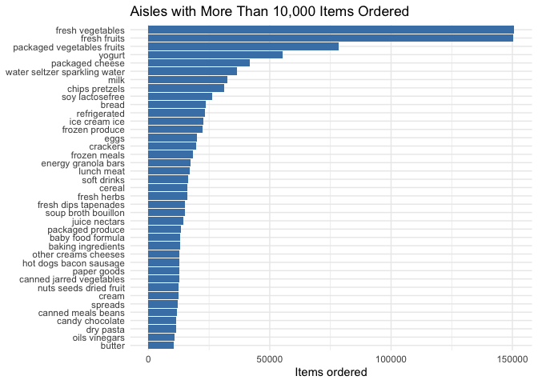

Homework 3 sc5558
================
Shiyun Angel Cheng

## Problem 0

``` r
library(tidyverse)
```

    ## ── Attaching core tidyverse packages ──────────────────────── tidyverse 2.0.0 ──
    ## ✔ dplyr     1.1.4     ✔ readr     2.1.5
    ## ✔ forcats   1.0.0     ✔ stringr   1.5.1
    ## ✔ ggplot2   3.5.2     ✔ tibble    3.3.0
    ## ✔ lubridate 1.9.4     ✔ tidyr     1.3.1
    ## ✔ purrr     1.1.0     
    ## ── Conflicts ────────────────────────────────────────── tidyverse_conflicts() ──
    ## ✖ dplyr::filter() masks stats::filter()
    ## ✖ dplyr::lag()    masks stats::lag()
    ## ℹ Use the conflicted package (<http://conflicted.r-lib.org/>) to force all conflicts to become errors

``` r
library(janitor)
```

    ## 
    ## Attaching package: 'janitor'
    ## 
    ## The following objects are masked from 'package:stats':
    ## 
    ##     chisq.test, fisher.test

``` r
library(lubridate)
library(gt)
library(patchwork)
library(scales)
```

    ## 
    ## Attaching package: 'scales'
    ## 
    ## The following object is masked from 'package:purrr':
    ## 
    ##     discard
    ## 
    ## The following object is masked from 'package:readr':
    ## 
    ##     col_factor

## Problem 1

This problem uses the Instacart data. DO NOT include this dataset in
your local data directory; instead, load the data from the
p8105.datasets using:

``` r
library(p8105.datasets)
data("instacart")
```

The goal is to do some exploration of this dataset. To that end, write a
short description of the dataset, noting the size and structure of the
data, describing some key variables, and giving illstrative examples of
observations.

Now I am conducting an initial exploraion of the dataset

``` r
instacart = instacart |>
  janitor::clean_names()

instacart |> glimpse()
```

    ## Rows: 1,384,617
    ## Columns: 15
    ## $ order_id               <int> 1, 1, 1, 1, 1, 1, 1, 1, 36, 36, 36, 36, 36, 36,…
    ## $ product_id             <int> 49302, 11109, 10246, 49683, 43633, 13176, 47209…
    ## $ add_to_cart_order      <int> 1, 2, 3, 4, 5, 6, 7, 8, 1, 2, 3, 4, 5, 6, 7, 8,…
    ## $ reordered              <int> 1, 1, 0, 0, 1, 0, 0, 1, 0, 1, 0, 1, 1, 1, 1, 1,…
    ## $ user_id                <int> 112108, 112108, 112108, 112108, 112108, 112108,…
    ## $ eval_set               <chr> "train", "train", "train", "train", "train", "t…
    ## $ order_number           <int> 4, 4, 4, 4, 4, 4, 4, 4, 23, 23, 23, 23, 23, 23,…
    ## $ order_dow              <int> 4, 4, 4, 4, 4, 4, 4, 4, 6, 6, 6, 6, 6, 6, 6, 6,…
    ## $ order_hour_of_day      <int> 10, 10, 10, 10, 10, 10, 10, 10, 18, 18, 18, 18,…
    ## $ days_since_prior_order <int> 9, 9, 9, 9, 9, 9, 9, 9, 30, 30, 30, 30, 30, 30,…
    ## $ product_name           <chr> "Bulgarian Yogurt", "Organic 4% Milk Fat Whole …
    ## $ aisle_id               <int> 120, 108, 83, 83, 95, 24, 24, 21, 2, 115, 53, 1…
    ## $ department_id          <int> 16, 16, 4, 4, 15, 4, 4, 16, 16, 7, 16, 4, 16, 2…
    ## $ aisle                  <chr> "yogurt", "other creams cheeses", "fresh vegeta…
    ## $ department             <chr> "dairy eggs", "dairy eggs", "produce", "produce…

This dataset contains grocery orders from Instacart. Each observation
represents a single product purchased by a user in a single order. The
dataset has 1384617 observations and 15 variables. Key variables
include:

product_name, aisle, and department: describe the purchased product;

order_hour_of_day and order_dow: describe when the order was placed;

add_to_cart_order and reordered: describe the user’s shopping behavior.

Now we move on to answering the following quesitons: 1. How many aisles
are there, and which aisles are the most items ordered from?

``` r
aisle_counts = instacart |>
  count(aisle, name = "n_items") |>
  arrange(desc(n_items))

n_aisles = nrow(aisle_counts)
top_aisles = aisle_counts |> slice_max(n_items, n = 5)

n_aisles
```

    ## [1] 134

There are 134 aisles in total. The top 5 aisles by number of items
ordered are below:

``` r
top_aisles |>
  gt() |>
  cols_label(
    aisle = "Aisle",
    n_items = "Items ordered"
  ) |>
  tab_header(title = "Top 5 Aisles by Items Ordered")
```

<div id="pompairptb" style="padding-left:0px;padding-right:0px;padding-top:10px;padding-bottom:10px;overflow-x:auto;overflow-y:auto;width:auto;height:auto;">
<style>#pompairptb table {
  font-family: system-ui, 'Segoe UI', Roboto, Helvetica, Arial, sans-serif, 'Apple Color Emoji', 'Segoe UI Emoji', 'Segoe UI Symbol', 'Noto Color Emoji';
  -webkit-font-smoothing: antialiased;
  -moz-osx-font-smoothing: grayscale;
}
&#10;#pompairptb thead, #pompairptb tbody, #pompairptb tfoot, #pompairptb tr, #pompairptb td, #pompairptb th {
  border-style: none;
}
&#10;#pompairptb p {
  margin: 0;
  padding: 0;
}
&#10;#pompairptb .gt_table {
  display: table;
  border-collapse: collapse;
  line-height: normal;
  margin-left: auto;
  margin-right: auto;
  color: #333333;
  font-size: 16px;
  font-weight: normal;
  font-style: normal;
  background-color: #FFFFFF;
  width: auto;
  border-top-style: solid;
  border-top-width: 2px;
  border-top-color: #A8A8A8;
  border-right-style: none;
  border-right-width: 2px;
  border-right-color: #D3D3D3;
  border-bottom-style: solid;
  border-bottom-width: 2px;
  border-bottom-color: #A8A8A8;
  border-left-style: none;
  border-left-width: 2px;
  border-left-color: #D3D3D3;
}
&#10;#pompairptb .gt_caption {
  padding-top: 4px;
  padding-bottom: 4px;
}
&#10;#pompairptb .gt_title {
  color: #333333;
  font-size: 125%;
  font-weight: initial;
  padding-top: 4px;
  padding-bottom: 4px;
  padding-left: 5px;
  padding-right: 5px;
  border-bottom-color: #FFFFFF;
  border-bottom-width: 0;
}
&#10;#pompairptb .gt_subtitle {
  color: #333333;
  font-size: 85%;
  font-weight: initial;
  padding-top: 3px;
  padding-bottom: 5px;
  padding-left: 5px;
  padding-right: 5px;
  border-top-color: #FFFFFF;
  border-top-width: 0;
}
&#10;#pompairptb .gt_heading {
  background-color: #FFFFFF;
  text-align: center;
  border-bottom-color: #FFFFFF;
  border-left-style: none;
  border-left-width: 1px;
  border-left-color: #D3D3D3;
  border-right-style: none;
  border-right-width: 1px;
  border-right-color: #D3D3D3;
}
&#10;#pompairptb .gt_bottom_border {
  border-bottom-style: solid;
  border-bottom-width: 2px;
  border-bottom-color: #D3D3D3;
}
&#10;#pompairptb .gt_col_headings {
  border-top-style: solid;
  border-top-width: 2px;
  border-top-color: #D3D3D3;
  border-bottom-style: solid;
  border-bottom-width: 2px;
  border-bottom-color: #D3D3D3;
  border-left-style: none;
  border-left-width: 1px;
  border-left-color: #D3D3D3;
  border-right-style: none;
  border-right-width: 1px;
  border-right-color: #D3D3D3;
}
&#10;#pompairptb .gt_col_heading {
  color: #333333;
  background-color: #FFFFFF;
  font-size: 100%;
  font-weight: normal;
  text-transform: inherit;
  border-left-style: none;
  border-left-width: 1px;
  border-left-color: #D3D3D3;
  border-right-style: none;
  border-right-width: 1px;
  border-right-color: #D3D3D3;
  vertical-align: bottom;
  padding-top: 5px;
  padding-bottom: 6px;
  padding-left: 5px;
  padding-right: 5px;
  overflow-x: hidden;
}
&#10;#pompairptb .gt_column_spanner_outer {
  color: #333333;
  background-color: #FFFFFF;
  font-size: 100%;
  font-weight: normal;
  text-transform: inherit;
  padding-top: 0;
  padding-bottom: 0;
  padding-left: 4px;
  padding-right: 4px;
}
&#10;#pompairptb .gt_column_spanner_outer:first-child {
  padding-left: 0;
}
&#10;#pompairptb .gt_column_spanner_outer:last-child {
  padding-right: 0;
}
&#10;#pompairptb .gt_column_spanner {
  border-bottom-style: solid;
  border-bottom-width: 2px;
  border-bottom-color: #D3D3D3;
  vertical-align: bottom;
  padding-top: 5px;
  padding-bottom: 5px;
  overflow-x: hidden;
  display: inline-block;
  width: 100%;
}
&#10;#pompairptb .gt_spanner_row {
  border-bottom-style: hidden;
}
&#10;#pompairptb .gt_group_heading {
  padding-top: 8px;
  padding-bottom: 8px;
  padding-left: 5px;
  padding-right: 5px;
  color: #333333;
  background-color: #FFFFFF;
  font-size: 100%;
  font-weight: initial;
  text-transform: inherit;
  border-top-style: solid;
  border-top-width: 2px;
  border-top-color: #D3D3D3;
  border-bottom-style: solid;
  border-bottom-width: 2px;
  border-bottom-color: #D3D3D3;
  border-left-style: none;
  border-left-width: 1px;
  border-left-color: #D3D3D3;
  border-right-style: none;
  border-right-width: 1px;
  border-right-color: #D3D3D3;
  vertical-align: middle;
  text-align: left;
}
&#10;#pompairptb .gt_empty_group_heading {
  padding: 0.5px;
  color: #333333;
  background-color: #FFFFFF;
  font-size: 100%;
  font-weight: initial;
  border-top-style: solid;
  border-top-width: 2px;
  border-top-color: #D3D3D3;
  border-bottom-style: solid;
  border-bottom-width: 2px;
  border-bottom-color: #D3D3D3;
  vertical-align: middle;
}
&#10;#pompairptb .gt_from_md > :first-child {
  margin-top: 0;
}
&#10;#pompairptb .gt_from_md > :last-child {
  margin-bottom: 0;
}
&#10;#pompairptb .gt_row {
  padding-top: 8px;
  padding-bottom: 8px;
  padding-left: 5px;
  padding-right: 5px;
  margin: 10px;
  border-top-style: solid;
  border-top-width: 1px;
  border-top-color: #D3D3D3;
  border-left-style: none;
  border-left-width: 1px;
  border-left-color: #D3D3D3;
  border-right-style: none;
  border-right-width: 1px;
  border-right-color: #D3D3D3;
  vertical-align: middle;
  overflow-x: hidden;
}
&#10;#pompairptb .gt_stub {
  color: #333333;
  background-color: #FFFFFF;
  font-size: 100%;
  font-weight: initial;
  text-transform: inherit;
  border-right-style: solid;
  border-right-width: 2px;
  border-right-color: #D3D3D3;
  padding-left: 5px;
  padding-right: 5px;
}
&#10;#pompairptb .gt_stub_row_group {
  color: #333333;
  background-color: #FFFFFF;
  font-size: 100%;
  font-weight: initial;
  text-transform: inherit;
  border-right-style: solid;
  border-right-width: 2px;
  border-right-color: #D3D3D3;
  padding-left: 5px;
  padding-right: 5px;
  vertical-align: top;
}
&#10;#pompairptb .gt_row_group_first td {
  border-top-width: 2px;
}
&#10;#pompairptb .gt_row_group_first th {
  border-top-width: 2px;
}
&#10;#pompairptb .gt_summary_row {
  color: #333333;
  background-color: #FFFFFF;
  text-transform: inherit;
  padding-top: 8px;
  padding-bottom: 8px;
  padding-left: 5px;
  padding-right: 5px;
}
&#10;#pompairptb .gt_first_summary_row {
  border-top-style: solid;
  border-top-color: #D3D3D3;
}
&#10;#pompairptb .gt_first_summary_row.thick {
  border-top-width: 2px;
}
&#10;#pompairptb .gt_last_summary_row {
  padding-top: 8px;
  padding-bottom: 8px;
  padding-left: 5px;
  padding-right: 5px;
  border-bottom-style: solid;
  border-bottom-width: 2px;
  border-bottom-color: #D3D3D3;
}
&#10;#pompairptb .gt_grand_summary_row {
  color: #333333;
  background-color: #FFFFFF;
  text-transform: inherit;
  padding-top: 8px;
  padding-bottom: 8px;
  padding-left: 5px;
  padding-right: 5px;
}
&#10;#pompairptb .gt_first_grand_summary_row {
  padding-top: 8px;
  padding-bottom: 8px;
  padding-left: 5px;
  padding-right: 5px;
  border-top-style: double;
  border-top-width: 6px;
  border-top-color: #D3D3D3;
}
&#10;#pompairptb .gt_last_grand_summary_row_top {
  padding-top: 8px;
  padding-bottom: 8px;
  padding-left: 5px;
  padding-right: 5px;
  border-bottom-style: double;
  border-bottom-width: 6px;
  border-bottom-color: #D3D3D3;
}
&#10;#pompairptb .gt_striped {
  background-color: rgba(128, 128, 128, 0.05);
}
&#10;#pompairptb .gt_table_body {
  border-top-style: solid;
  border-top-width: 2px;
  border-top-color: #D3D3D3;
  border-bottom-style: solid;
  border-bottom-width: 2px;
  border-bottom-color: #D3D3D3;
}
&#10;#pompairptb .gt_footnotes {
  color: #333333;
  background-color: #FFFFFF;
  border-bottom-style: none;
  border-bottom-width: 2px;
  border-bottom-color: #D3D3D3;
  border-left-style: none;
  border-left-width: 2px;
  border-left-color: #D3D3D3;
  border-right-style: none;
  border-right-width: 2px;
  border-right-color: #D3D3D3;
}
&#10;#pompairptb .gt_footnote {
  margin: 0px;
  font-size: 90%;
  padding-top: 4px;
  padding-bottom: 4px;
  padding-left: 5px;
  padding-right: 5px;
}
&#10;#pompairptb .gt_sourcenotes {
  color: #333333;
  background-color: #FFFFFF;
  border-bottom-style: none;
  border-bottom-width: 2px;
  border-bottom-color: #D3D3D3;
  border-left-style: none;
  border-left-width: 2px;
  border-left-color: #D3D3D3;
  border-right-style: none;
  border-right-width: 2px;
  border-right-color: #D3D3D3;
}
&#10;#pompairptb .gt_sourcenote {
  font-size: 90%;
  padding-top: 4px;
  padding-bottom: 4px;
  padding-left: 5px;
  padding-right: 5px;
}
&#10;#pompairptb .gt_left {
  text-align: left;
}
&#10;#pompairptb .gt_center {
  text-align: center;
}
&#10;#pompairptb .gt_right {
  text-align: right;
  font-variant-numeric: tabular-nums;
}
&#10;#pompairptb .gt_font_normal {
  font-weight: normal;
}
&#10;#pompairptb .gt_font_bold {
  font-weight: bold;
}
&#10;#pompairptb .gt_font_italic {
  font-style: italic;
}
&#10;#pompairptb .gt_super {
  font-size: 65%;
}
&#10;#pompairptb .gt_footnote_marks {
  font-size: 75%;
  vertical-align: 0.4em;
  position: initial;
}
&#10;#pompairptb .gt_asterisk {
  font-size: 100%;
  vertical-align: 0;
}
&#10;#pompairptb .gt_indent_1 {
  text-indent: 5px;
}
&#10;#pompairptb .gt_indent_2 {
  text-indent: 10px;
}
&#10;#pompairptb .gt_indent_3 {
  text-indent: 15px;
}
&#10;#pompairptb .gt_indent_4 {
  text-indent: 20px;
}
&#10;#pompairptb .gt_indent_5 {
  text-indent: 25px;
}
&#10;#pompairptb .katex-display {
  display: inline-flex !important;
  margin-bottom: 0.75em !important;
}
&#10;#pompairptb div.Reactable > div.rt-table > div.rt-thead > div.rt-tr.rt-tr-group-header > div.rt-th-group:after {
  height: 0px !important;
}
</style>
<table class="gt_table" data-quarto-disable-processing="false" data-quarto-bootstrap="false">
  <thead>
    <tr class="gt_heading">
      <td colspan="2" class="gt_heading gt_title gt_font_normal gt_bottom_border" style>Top 5 Aisles by Items Ordered</td>
    </tr>
    &#10;    <tr class="gt_col_headings">
      <th class="gt_col_heading gt_columns_bottom_border gt_left" rowspan="1" colspan="1" scope="col" id="aisle">Aisle</th>
      <th class="gt_col_heading gt_columns_bottom_border gt_right" rowspan="1" colspan="1" scope="col" id="n_items">Items ordered</th>
    </tr>
  </thead>
  <tbody class="gt_table_body">
    <tr><td headers="aisle" class="gt_row gt_left">fresh vegetables</td>
<td headers="n_items" class="gt_row gt_right">150609</td></tr>
    <tr><td headers="aisle" class="gt_row gt_left">fresh fruits</td>
<td headers="n_items" class="gt_row gt_right">150473</td></tr>
    <tr><td headers="aisle" class="gt_row gt_left">packaged vegetables fruits</td>
<td headers="n_items" class="gt_row gt_right">78493</td></tr>
    <tr><td headers="aisle" class="gt_row gt_left">yogurt</td>
<td headers="n_items" class="gt_row gt_right">55240</td></tr>
    <tr><td headers="aisle" class="gt_row gt_left">packaged cheese</td>
<td headers="n_items" class="gt_row gt_right">41699</td></tr>
  </tbody>
  &#10;</table>
</div>

2.  Make a plot that shows the number of items ordered in each aisle,
    limiting this to aisles with more than 10000 items ordered. Arrange
    aisles sensibly, and organize your plot so others can read it.

``` r
instacart |>
  count(aisle, name = "n_items") |>
  filter(n_items > 10000) |>
  mutate(aisle = fct_reorder(aisle, n_items)) |>
  ggplot(aes(x = aisle, y = n_items)) +
  geom_col(fill = "steelblue") +
  coord_flip() +
  labs(
    title = "Aisles with More Than 10,000 Items Ordered",
    x = NULL,
    y = "Items ordered"
  ) +
  theme_minimal()
```

<!-- -->
This plot emphasizes that fresh produce and dairy products are ordered
most.

3.  Make a table showing the three most popular items in each of the
    aisles “baking ingredients”, “dog food care”, and “packaged
    vegetables fruits”. Include the number of times each item is ordered
    in your table.

``` r
selected_aisles = c("baking ingredients", "dog food care", "packaged vegetables fruits")

instacart |>
  filter(aisle %in% selected_aisles) |>
  count(aisle, product_name, name = "n") |>
  group_by(aisle) |>
  slice_max(n, n = 3) |>
  ungroup() |>
  arrange(aisle, desc(n)) |>
  gt(groupname_col = "aisle") |>
  cols_label(
    product_name = "Product",
    n = "Times ordered"
  ) |>
  tab_header(title = "Top 3 Products in Selected Aisles")
```

<div id="fwhmtwnyjd" style="padding-left:0px;padding-right:0px;padding-top:10px;padding-bottom:10px;overflow-x:auto;overflow-y:auto;width:auto;height:auto;">
<style>#fwhmtwnyjd table {
  font-family: system-ui, 'Segoe UI', Roboto, Helvetica, Arial, sans-serif, 'Apple Color Emoji', 'Segoe UI Emoji', 'Segoe UI Symbol', 'Noto Color Emoji';
  -webkit-font-smoothing: antialiased;
  -moz-osx-font-smoothing: grayscale;
}
&#10;#fwhmtwnyjd thead, #fwhmtwnyjd tbody, #fwhmtwnyjd tfoot, #fwhmtwnyjd tr, #fwhmtwnyjd td, #fwhmtwnyjd th {
  border-style: none;
}
&#10;#fwhmtwnyjd p {
  margin: 0;
  padding: 0;
}
&#10;#fwhmtwnyjd .gt_table {
  display: table;
  border-collapse: collapse;
  line-height: normal;
  margin-left: auto;
  margin-right: auto;
  color: #333333;
  font-size: 16px;
  font-weight: normal;
  font-style: normal;
  background-color: #FFFFFF;
  width: auto;
  border-top-style: solid;
  border-top-width: 2px;
  border-top-color: #A8A8A8;
  border-right-style: none;
  border-right-width: 2px;
  border-right-color: #D3D3D3;
  border-bottom-style: solid;
  border-bottom-width: 2px;
  border-bottom-color: #A8A8A8;
  border-left-style: none;
  border-left-width: 2px;
  border-left-color: #D3D3D3;
}
&#10;#fwhmtwnyjd .gt_caption {
  padding-top: 4px;
  padding-bottom: 4px;
}
&#10;#fwhmtwnyjd .gt_title {
  color: #333333;
  font-size: 125%;
  font-weight: initial;
  padding-top: 4px;
  padding-bottom: 4px;
  padding-left: 5px;
  padding-right: 5px;
  border-bottom-color: #FFFFFF;
  border-bottom-width: 0;
}
&#10;#fwhmtwnyjd .gt_subtitle {
  color: #333333;
  font-size: 85%;
  font-weight: initial;
  padding-top: 3px;
  padding-bottom: 5px;
  padding-left: 5px;
  padding-right: 5px;
  border-top-color: #FFFFFF;
  border-top-width: 0;
}
&#10;#fwhmtwnyjd .gt_heading {
  background-color: #FFFFFF;
  text-align: center;
  border-bottom-color: #FFFFFF;
  border-left-style: none;
  border-left-width: 1px;
  border-left-color: #D3D3D3;
  border-right-style: none;
  border-right-width: 1px;
  border-right-color: #D3D3D3;
}
&#10;#fwhmtwnyjd .gt_bottom_border {
  border-bottom-style: solid;
  border-bottom-width: 2px;
  border-bottom-color: #D3D3D3;
}
&#10;#fwhmtwnyjd .gt_col_headings {
  border-top-style: solid;
  border-top-width: 2px;
  border-top-color: #D3D3D3;
  border-bottom-style: solid;
  border-bottom-width: 2px;
  border-bottom-color: #D3D3D3;
  border-left-style: none;
  border-left-width: 1px;
  border-left-color: #D3D3D3;
  border-right-style: none;
  border-right-width: 1px;
  border-right-color: #D3D3D3;
}
&#10;#fwhmtwnyjd .gt_col_heading {
  color: #333333;
  background-color: #FFFFFF;
  font-size: 100%;
  font-weight: normal;
  text-transform: inherit;
  border-left-style: none;
  border-left-width: 1px;
  border-left-color: #D3D3D3;
  border-right-style: none;
  border-right-width: 1px;
  border-right-color: #D3D3D3;
  vertical-align: bottom;
  padding-top: 5px;
  padding-bottom: 6px;
  padding-left: 5px;
  padding-right: 5px;
  overflow-x: hidden;
}
&#10;#fwhmtwnyjd .gt_column_spanner_outer {
  color: #333333;
  background-color: #FFFFFF;
  font-size: 100%;
  font-weight: normal;
  text-transform: inherit;
  padding-top: 0;
  padding-bottom: 0;
  padding-left: 4px;
  padding-right: 4px;
}
&#10;#fwhmtwnyjd .gt_column_spanner_outer:first-child {
  padding-left: 0;
}
&#10;#fwhmtwnyjd .gt_column_spanner_outer:last-child {
  padding-right: 0;
}
&#10;#fwhmtwnyjd .gt_column_spanner {
  border-bottom-style: solid;
  border-bottom-width: 2px;
  border-bottom-color: #D3D3D3;
  vertical-align: bottom;
  padding-top: 5px;
  padding-bottom: 5px;
  overflow-x: hidden;
  display: inline-block;
  width: 100%;
}
&#10;#fwhmtwnyjd .gt_spanner_row {
  border-bottom-style: hidden;
}
&#10;#fwhmtwnyjd .gt_group_heading {
  padding-top: 8px;
  padding-bottom: 8px;
  padding-left: 5px;
  padding-right: 5px;
  color: #333333;
  background-color: #FFFFFF;
  font-size: 100%;
  font-weight: initial;
  text-transform: inherit;
  border-top-style: solid;
  border-top-width: 2px;
  border-top-color: #D3D3D3;
  border-bottom-style: solid;
  border-bottom-width: 2px;
  border-bottom-color: #D3D3D3;
  border-left-style: none;
  border-left-width: 1px;
  border-left-color: #D3D3D3;
  border-right-style: none;
  border-right-width: 1px;
  border-right-color: #D3D3D3;
  vertical-align: middle;
  text-align: left;
}
&#10;#fwhmtwnyjd .gt_empty_group_heading {
  padding: 0.5px;
  color: #333333;
  background-color: #FFFFFF;
  font-size: 100%;
  font-weight: initial;
  border-top-style: solid;
  border-top-width: 2px;
  border-top-color: #D3D3D3;
  border-bottom-style: solid;
  border-bottom-width: 2px;
  border-bottom-color: #D3D3D3;
  vertical-align: middle;
}
&#10;#fwhmtwnyjd .gt_from_md > :first-child {
  margin-top: 0;
}
&#10;#fwhmtwnyjd .gt_from_md > :last-child {
  margin-bottom: 0;
}
&#10;#fwhmtwnyjd .gt_row {
  padding-top: 8px;
  padding-bottom: 8px;
  padding-left: 5px;
  padding-right: 5px;
  margin: 10px;
  border-top-style: solid;
  border-top-width: 1px;
  border-top-color: #D3D3D3;
  border-left-style: none;
  border-left-width: 1px;
  border-left-color: #D3D3D3;
  border-right-style: none;
  border-right-width: 1px;
  border-right-color: #D3D3D3;
  vertical-align: middle;
  overflow-x: hidden;
}
&#10;#fwhmtwnyjd .gt_stub {
  color: #333333;
  background-color: #FFFFFF;
  font-size: 100%;
  font-weight: initial;
  text-transform: inherit;
  border-right-style: solid;
  border-right-width: 2px;
  border-right-color: #D3D3D3;
  padding-left: 5px;
  padding-right: 5px;
}
&#10;#fwhmtwnyjd .gt_stub_row_group {
  color: #333333;
  background-color: #FFFFFF;
  font-size: 100%;
  font-weight: initial;
  text-transform: inherit;
  border-right-style: solid;
  border-right-width: 2px;
  border-right-color: #D3D3D3;
  padding-left: 5px;
  padding-right: 5px;
  vertical-align: top;
}
&#10;#fwhmtwnyjd .gt_row_group_first td {
  border-top-width: 2px;
}
&#10;#fwhmtwnyjd .gt_row_group_first th {
  border-top-width: 2px;
}
&#10;#fwhmtwnyjd .gt_summary_row {
  color: #333333;
  background-color: #FFFFFF;
  text-transform: inherit;
  padding-top: 8px;
  padding-bottom: 8px;
  padding-left: 5px;
  padding-right: 5px;
}
&#10;#fwhmtwnyjd .gt_first_summary_row {
  border-top-style: solid;
  border-top-color: #D3D3D3;
}
&#10;#fwhmtwnyjd .gt_first_summary_row.thick {
  border-top-width: 2px;
}
&#10;#fwhmtwnyjd .gt_last_summary_row {
  padding-top: 8px;
  padding-bottom: 8px;
  padding-left: 5px;
  padding-right: 5px;
  border-bottom-style: solid;
  border-bottom-width: 2px;
  border-bottom-color: #D3D3D3;
}
&#10;#fwhmtwnyjd .gt_grand_summary_row {
  color: #333333;
  background-color: #FFFFFF;
  text-transform: inherit;
  padding-top: 8px;
  padding-bottom: 8px;
  padding-left: 5px;
  padding-right: 5px;
}
&#10;#fwhmtwnyjd .gt_first_grand_summary_row {
  padding-top: 8px;
  padding-bottom: 8px;
  padding-left: 5px;
  padding-right: 5px;
  border-top-style: double;
  border-top-width: 6px;
  border-top-color: #D3D3D3;
}
&#10;#fwhmtwnyjd .gt_last_grand_summary_row_top {
  padding-top: 8px;
  padding-bottom: 8px;
  padding-left: 5px;
  padding-right: 5px;
  border-bottom-style: double;
  border-bottom-width: 6px;
  border-bottom-color: #D3D3D3;
}
&#10;#fwhmtwnyjd .gt_striped {
  background-color: rgba(128, 128, 128, 0.05);
}
&#10;#fwhmtwnyjd .gt_table_body {
  border-top-style: solid;
  border-top-width: 2px;
  border-top-color: #D3D3D3;
  border-bottom-style: solid;
  border-bottom-width: 2px;
  border-bottom-color: #D3D3D3;
}
&#10;#fwhmtwnyjd .gt_footnotes {
  color: #333333;
  background-color: #FFFFFF;
  border-bottom-style: none;
  border-bottom-width: 2px;
  border-bottom-color: #D3D3D3;
  border-left-style: none;
  border-left-width: 2px;
  border-left-color: #D3D3D3;
  border-right-style: none;
  border-right-width: 2px;
  border-right-color: #D3D3D3;
}
&#10;#fwhmtwnyjd .gt_footnote {
  margin: 0px;
  font-size: 90%;
  padding-top: 4px;
  padding-bottom: 4px;
  padding-left: 5px;
  padding-right: 5px;
}
&#10;#fwhmtwnyjd .gt_sourcenotes {
  color: #333333;
  background-color: #FFFFFF;
  border-bottom-style: none;
  border-bottom-width: 2px;
  border-bottom-color: #D3D3D3;
  border-left-style: none;
  border-left-width: 2px;
  border-left-color: #D3D3D3;
  border-right-style: none;
  border-right-width: 2px;
  border-right-color: #D3D3D3;
}
&#10;#fwhmtwnyjd .gt_sourcenote {
  font-size: 90%;
  padding-top: 4px;
  padding-bottom: 4px;
  padding-left: 5px;
  padding-right: 5px;
}
&#10;#fwhmtwnyjd .gt_left {
  text-align: left;
}
&#10;#fwhmtwnyjd .gt_center {
  text-align: center;
}
&#10;#fwhmtwnyjd .gt_right {
  text-align: right;
  font-variant-numeric: tabular-nums;
}
&#10;#fwhmtwnyjd .gt_font_normal {
  font-weight: normal;
}
&#10;#fwhmtwnyjd .gt_font_bold {
  font-weight: bold;
}
&#10;#fwhmtwnyjd .gt_font_italic {
  font-style: italic;
}
&#10;#fwhmtwnyjd .gt_super {
  font-size: 65%;
}
&#10;#fwhmtwnyjd .gt_footnote_marks {
  font-size: 75%;
  vertical-align: 0.4em;
  position: initial;
}
&#10;#fwhmtwnyjd .gt_asterisk {
  font-size: 100%;
  vertical-align: 0;
}
&#10;#fwhmtwnyjd .gt_indent_1 {
  text-indent: 5px;
}
&#10;#fwhmtwnyjd .gt_indent_2 {
  text-indent: 10px;
}
&#10;#fwhmtwnyjd .gt_indent_3 {
  text-indent: 15px;
}
&#10;#fwhmtwnyjd .gt_indent_4 {
  text-indent: 20px;
}
&#10;#fwhmtwnyjd .gt_indent_5 {
  text-indent: 25px;
}
&#10;#fwhmtwnyjd .katex-display {
  display: inline-flex !important;
  margin-bottom: 0.75em !important;
}
&#10;#fwhmtwnyjd div.Reactable > div.rt-table > div.rt-thead > div.rt-tr.rt-tr-group-header > div.rt-th-group:after {
  height: 0px !important;
}
</style>
<table class="gt_table" data-quarto-disable-processing="false" data-quarto-bootstrap="false">
  <thead>
    <tr class="gt_heading">
      <td colspan="2" class="gt_heading gt_title gt_font_normal gt_bottom_border" style>Top 3 Products in Selected Aisles</td>
    </tr>
    &#10;    <tr class="gt_col_headings">
      <th class="gt_col_heading gt_columns_bottom_border gt_left" rowspan="1" colspan="1" scope="col" id="product_name">Product</th>
      <th class="gt_col_heading gt_columns_bottom_border gt_right" rowspan="1" colspan="1" scope="col" id="n">Times ordered</th>
    </tr>
  </thead>
  <tbody class="gt_table_body">
    <tr class="gt_group_heading_row">
      <th colspan="2" class="gt_group_heading" scope="colgroup" id="baking ingredients">baking ingredients</th>
    </tr>
    <tr class="gt_row_group_first"><td headers="baking ingredients  product_name" class="gt_row gt_left">Light Brown Sugar</td>
<td headers="baking ingredients  n" class="gt_row gt_right">499</td></tr>
    <tr><td headers="baking ingredients  product_name" class="gt_row gt_left">Pure Baking Soda</td>
<td headers="baking ingredients  n" class="gt_row gt_right">387</td></tr>
    <tr><td headers="baking ingredients  product_name" class="gt_row gt_left">Cane Sugar</td>
<td headers="baking ingredients  n" class="gt_row gt_right">336</td></tr>
    <tr class="gt_group_heading_row">
      <th colspan="2" class="gt_group_heading" scope="colgroup" id="dog food care">dog food care</th>
    </tr>
    <tr class="gt_row_group_first"><td headers="dog food care  product_name" class="gt_row gt_left">Snack Sticks Chicken &amp; Rice Recipe Dog Treats</td>
<td headers="dog food care  n" class="gt_row gt_right">30</td></tr>
    <tr><td headers="dog food care  product_name" class="gt_row gt_left">Organix Chicken &amp; Brown Rice Recipe</td>
<td headers="dog food care  n" class="gt_row gt_right">28</td></tr>
    <tr><td headers="dog food care  product_name" class="gt_row gt_left">Small Dog Biscuits</td>
<td headers="dog food care  n" class="gt_row gt_right">26</td></tr>
    <tr class="gt_group_heading_row">
      <th colspan="2" class="gt_group_heading" scope="colgroup" id="packaged vegetables fruits">packaged vegetables fruits</th>
    </tr>
    <tr class="gt_row_group_first"><td headers="packaged vegetables fruits  product_name" class="gt_row gt_left">Organic Baby Spinach</td>
<td headers="packaged vegetables fruits  n" class="gt_row gt_right">9784</td></tr>
    <tr><td headers="packaged vegetables fruits  product_name" class="gt_row gt_left">Organic Raspberries</td>
<td headers="packaged vegetables fruits  n" class="gt_row gt_right">5546</td></tr>
    <tr><td headers="packaged vegetables fruits  product_name" class="gt_row gt_left">Organic Blueberries</td>
<td headers="packaged vegetables fruits  n" class="gt_row gt_right">4966</td></tr>
  </tbody>
  &#10;</table>
</div>

Packaged vegetables fruits aisle are ordered most times, with baking
ingredients and dog food care following. For packaged vegetables fruits,
organic baby spinach and raspberries are ordered most.For baking
ingredients, brown sugar, baking soda, and cane sugar are ordered most.
For dog food care, dog treats, recipe, and dog biscuits are ordered
most.

4.  Make a table showing the mean hour of the day at which Pink Lady
    Apples and Coffee Ice Cream are ordered on each day of the week;
    format this table for human readers (i.e. produce a 2 x 7 table).

``` r
instacart |>
  filter(product_name %in% c("Pink Lady Apples", "Coffee Ice Cream")) |>
  group_by(product_name, order_dow) |>
  summarize(mean_hour = mean(order_hour_of_day), .groups = "drop") |>
  mutate(order_dow = factor(order_dow, levels = 0:6,
                            labels = c("Sun", "Mon", "Tue", "Wed", "Thu", "Fri", "Sat"))) |>
  pivot_wider(names_from = order_dow, values_from = mean_hour) |>
  gt(rowname_col = "product_name") |>
  fmt_number(everything(), decimals = 2) |>
  tab_header(title = "Mean Order Hour by Day of Week")
```

<div id="sruiqhbcit" style="padding-left:0px;padding-right:0px;padding-top:10px;padding-bottom:10px;overflow-x:auto;overflow-y:auto;width:auto;height:auto;">
<style>#sruiqhbcit table {
  font-family: system-ui, 'Segoe UI', Roboto, Helvetica, Arial, sans-serif, 'Apple Color Emoji', 'Segoe UI Emoji', 'Segoe UI Symbol', 'Noto Color Emoji';
  -webkit-font-smoothing: antialiased;
  -moz-osx-font-smoothing: grayscale;
}
&#10;#sruiqhbcit thead, #sruiqhbcit tbody, #sruiqhbcit tfoot, #sruiqhbcit tr, #sruiqhbcit td, #sruiqhbcit th {
  border-style: none;
}
&#10;#sruiqhbcit p {
  margin: 0;
  padding: 0;
}
&#10;#sruiqhbcit .gt_table {
  display: table;
  border-collapse: collapse;
  line-height: normal;
  margin-left: auto;
  margin-right: auto;
  color: #333333;
  font-size: 16px;
  font-weight: normal;
  font-style: normal;
  background-color: #FFFFFF;
  width: auto;
  border-top-style: solid;
  border-top-width: 2px;
  border-top-color: #A8A8A8;
  border-right-style: none;
  border-right-width: 2px;
  border-right-color: #D3D3D3;
  border-bottom-style: solid;
  border-bottom-width: 2px;
  border-bottom-color: #A8A8A8;
  border-left-style: none;
  border-left-width: 2px;
  border-left-color: #D3D3D3;
}
&#10;#sruiqhbcit .gt_caption {
  padding-top: 4px;
  padding-bottom: 4px;
}
&#10;#sruiqhbcit .gt_title {
  color: #333333;
  font-size: 125%;
  font-weight: initial;
  padding-top: 4px;
  padding-bottom: 4px;
  padding-left: 5px;
  padding-right: 5px;
  border-bottom-color: #FFFFFF;
  border-bottom-width: 0;
}
&#10;#sruiqhbcit .gt_subtitle {
  color: #333333;
  font-size: 85%;
  font-weight: initial;
  padding-top: 3px;
  padding-bottom: 5px;
  padding-left: 5px;
  padding-right: 5px;
  border-top-color: #FFFFFF;
  border-top-width: 0;
}
&#10;#sruiqhbcit .gt_heading {
  background-color: #FFFFFF;
  text-align: center;
  border-bottom-color: #FFFFFF;
  border-left-style: none;
  border-left-width: 1px;
  border-left-color: #D3D3D3;
  border-right-style: none;
  border-right-width: 1px;
  border-right-color: #D3D3D3;
}
&#10;#sruiqhbcit .gt_bottom_border {
  border-bottom-style: solid;
  border-bottom-width: 2px;
  border-bottom-color: #D3D3D3;
}
&#10;#sruiqhbcit .gt_col_headings {
  border-top-style: solid;
  border-top-width: 2px;
  border-top-color: #D3D3D3;
  border-bottom-style: solid;
  border-bottom-width: 2px;
  border-bottom-color: #D3D3D3;
  border-left-style: none;
  border-left-width: 1px;
  border-left-color: #D3D3D3;
  border-right-style: none;
  border-right-width: 1px;
  border-right-color: #D3D3D3;
}
&#10;#sruiqhbcit .gt_col_heading {
  color: #333333;
  background-color: #FFFFFF;
  font-size: 100%;
  font-weight: normal;
  text-transform: inherit;
  border-left-style: none;
  border-left-width: 1px;
  border-left-color: #D3D3D3;
  border-right-style: none;
  border-right-width: 1px;
  border-right-color: #D3D3D3;
  vertical-align: bottom;
  padding-top: 5px;
  padding-bottom: 6px;
  padding-left: 5px;
  padding-right: 5px;
  overflow-x: hidden;
}
&#10;#sruiqhbcit .gt_column_spanner_outer {
  color: #333333;
  background-color: #FFFFFF;
  font-size: 100%;
  font-weight: normal;
  text-transform: inherit;
  padding-top: 0;
  padding-bottom: 0;
  padding-left: 4px;
  padding-right: 4px;
}
&#10;#sruiqhbcit .gt_column_spanner_outer:first-child {
  padding-left: 0;
}
&#10;#sruiqhbcit .gt_column_spanner_outer:last-child {
  padding-right: 0;
}
&#10;#sruiqhbcit .gt_column_spanner {
  border-bottom-style: solid;
  border-bottom-width: 2px;
  border-bottom-color: #D3D3D3;
  vertical-align: bottom;
  padding-top: 5px;
  padding-bottom: 5px;
  overflow-x: hidden;
  display: inline-block;
  width: 100%;
}
&#10;#sruiqhbcit .gt_spanner_row {
  border-bottom-style: hidden;
}
&#10;#sruiqhbcit .gt_group_heading {
  padding-top: 8px;
  padding-bottom: 8px;
  padding-left: 5px;
  padding-right: 5px;
  color: #333333;
  background-color: #FFFFFF;
  font-size: 100%;
  font-weight: initial;
  text-transform: inherit;
  border-top-style: solid;
  border-top-width: 2px;
  border-top-color: #D3D3D3;
  border-bottom-style: solid;
  border-bottom-width: 2px;
  border-bottom-color: #D3D3D3;
  border-left-style: none;
  border-left-width: 1px;
  border-left-color: #D3D3D3;
  border-right-style: none;
  border-right-width: 1px;
  border-right-color: #D3D3D3;
  vertical-align: middle;
  text-align: left;
}
&#10;#sruiqhbcit .gt_empty_group_heading {
  padding: 0.5px;
  color: #333333;
  background-color: #FFFFFF;
  font-size: 100%;
  font-weight: initial;
  border-top-style: solid;
  border-top-width: 2px;
  border-top-color: #D3D3D3;
  border-bottom-style: solid;
  border-bottom-width: 2px;
  border-bottom-color: #D3D3D3;
  vertical-align: middle;
}
&#10;#sruiqhbcit .gt_from_md > :first-child {
  margin-top: 0;
}
&#10;#sruiqhbcit .gt_from_md > :last-child {
  margin-bottom: 0;
}
&#10;#sruiqhbcit .gt_row {
  padding-top: 8px;
  padding-bottom: 8px;
  padding-left: 5px;
  padding-right: 5px;
  margin: 10px;
  border-top-style: solid;
  border-top-width: 1px;
  border-top-color: #D3D3D3;
  border-left-style: none;
  border-left-width: 1px;
  border-left-color: #D3D3D3;
  border-right-style: none;
  border-right-width: 1px;
  border-right-color: #D3D3D3;
  vertical-align: middle;
  overflow-x: hidden;
}
&#10;#sruiqhbcit .gt_stub {
  color: #333333;
  background-color: #FFFFFF;
  font-size: 100%;
  font-weight: initial;
  text-transform: inherit;
  border-right-style: solid;
  border-right-width: 2px;
  border-right-color: #D3D3D3;
  padding-left: 5px;
  padding-right: 5px;
}
&#10;#sruiqhbcit .gt_stub_row_group {
  color: #333333;
  background-color: #FFFFFF;
  font-size: 100%;
  font-weight: initial;
  text-transform: inherit;
  border-right-style: solid;
  border-right-width: 2px;
  border-right-color: #D3D3D3;
  padding-left: 5px;
  padding-right: 5px;
  vertical-align: top;
}
&#10;#sruiqhbcit .gt_row_group_first td {
  border-top-width: 2px;
}
&#10;#sruiqhbcit .gt_row_group_first th {
  border-top-width: 2px;
}
&#10;#sruiqhbcit .gt_summary_row {
  color: #333333;
  background-color: #FFFFFF;
  text-transform: inherit;
  padding-top: 8px;
  padding-bottom: 8px;
  padding-left: 5px;
  padding-right: 5px;
}
&#10;#sruiqhbcit .gt_first_summary_row {
  border-top-style: solid;
  border-top-color: #D3D3D3;
}
&#10;#sruiqhbcit .gt_first_summary_row.thick {
  border-top-width: 2px;
}
&#10;#sruiqhbcit .gt_last_summary_row {
  padding-top: 8px;
  padding-bottom: 8px;
  padding-left: 5px;
  padding-right: 5px;
  border-bottom-style: solid;
  border-bottom-width: 2px;
  border-bottom-color: #D3D3D3;
}
&#10;#sruiqhbcit .gt_grand_summary_row {
  color: #333333;
  background-color: #FFFFFF;
  text-transform: inherit;
  padding-top: 8px;
  padding-bottom: 8px;
  padding-left: 5px;
  padding-right: 5px;
}
&#10;#sruiqhbcit .gt_first_grand_summary_row {
  padding-top: 8px;
  padding-bottom: 8px;
  padding-left: 5px;
  padding-right: 5px;
  border-top-style: double;
  border-top-width: 6px;
  border-top-color: #D3D3D3;
}
&#10;#sruiqhbcit .gt_last_grand_summary_row_top {
  padding-top: 8px;
  padding-bottom: 8px;
  padding-left: 5px;
  padding-right: 5px;
  border-bottom-style: double;
  border-bottom-width: 6px;
  border-bottom-color: #D3D3D3;
}
&#10;#sruiqhbcit .gt_striped {
  background-color: rgba(128, 128, 128, 0.05);
}
&#10;#sruiqhbcit .gt_table_body {
  border-top-style: solid;
  border-top-width: 2px;
  border-top-color: #D3D3D3;
  border-bottom-style: solid;
  border-bottom-width: 2px;
  border-bottom-color: #D3D3D3;
}
&#10;#sruiqhbcit .gt_footnotes {
  color: #333333;
  background-color: #FFFFFF;
  border-bottom-style: none;
  border-bottom-width: 2px;
  border-bottom-color: #D3D3D3;
  border-left-style: none;
  border-left-width: 2px;
  border-left-color: #D3D3D3;
  border-right-style: none;
  border-right-width: 2px;
  border-right-color: #D3D3D3;
}
&#10;#sruiqhbcit .gt_footnote {
  margin: 0px;
  font-size: 90%;
  padding-top: 4px;
  padding-bottom: 4px;
  padding-left: 5px;
  padding-right: 5px;
}
&#10;#sruiqhbcit .gt_sourcenotes {
  color: #333333;
  background-color: #FFFFFF;
  border-bottom-style: none;
  border-bottom-width: 2px;
  border-bottom-color: #D3D3D3;
  border-left-style: none;
  border-left-width: 2px;
  border-left-color: #D3D3D3;
  border-right-style: none;
  border-right-width: 2px;
  border-right-color: #D3D3D3;
}
&#10;#sruiqhbcit .gt_sourcenote {
  font-size: 90%;
  padding-top: 4px;
  padding-bottom: 4px;
  padding-left: 5px;
  padding-right: 5px;
}
&#10;#sruiqhbcit .gt_left {
  text-align: left;
}
&#10;#sruiqhbcit .gt_center {
  text-align: center;
}
&#10;#sruiqhbcit .gt_right {
  text-align: right;
  font-variant-numeric: tabular-nums;
}
&#10;#sruiqhbcit .gt_font_normal {
  font-weight: normal;
}
&#10;#sruiqhbcit .gt_font_bold {
  font-weight: bold;
}
&#10;#sruiqhbcit .gt_font_italic {
  font-style: italic;
}
&#10;#sruiqhbcit .gt_super {
  font-size: 65%;
}
&#10;#sruiqhbcit .gt_footnote_marks {
  font-size: 75%;
  vertical-align: 0.4em;
  position: initial;
}
&#10;#sruiqhbcit .gt_asterisk {
  font-size: 100%;
  vertical-align: 0;
}
&#10;#sruiqhbcit .gt_indent_1 {
  text-indent: 5px;
}
&#10;#sruiqhbcit .gt_indent_2 {
  text-indent: 10px;
}
&#10;#sruiqhbcit .gt_indent_3 {
  text-indent: 15px;
}
&#10;#sruiqhbcit .gt_indent_4 {
  text-indent: 20px;
}
&#10;#sruiqhbcit .gt_indent_5 {
  text-indent: 25px;
}
&#10;#sruiqhbcit .katex-display {
  display: inline-flex !important;
  margin-bottom: 0.75em !important;
}
&#10;#sruiqhbcit div.Reactable > div.rt-table > div.rt-thead > div.rt-tr.rt-tr-group-header > div.rt-th-group:after {
  height: 0px !important;
}
</style>
<table class="gt_table" data-quarto-disable-processing="false" data-quarto-bootstrap="false">
  <thead>
    <tr class="gt_heading">
      <td colspan="8" class="gt_heading gt_title gt_font_normal gt_bottom_border" style>Mean Order Hour by Day of Week</td>
    </tr>
    &#10;    <tr class="gt_col_headings">
      <th class="gt_col_heading gt_columns_bottom_border gt_left" rowspan="1" colspan="1" scope="col" id="a::stub"></th>
      <th class="gt_col_heading gt_columns_bottom_border gt_right" rowspan="1" colspan="1" scope="col" id="Sun">Sun</th>
      <th class="gt_col_heading gt_columns_bottom_border gt_right" rowspan="1" colspan="1" scope="col" id="Mon">Mon</th>
      <th class="gt_col_heading gt_columns_bottom_border gt_right" rowspan="1" colspan="1" scope="col" id="Tue">Tue</th>
      <th class="gt_col_heading gt_columns_bottom_border gt_right" rowspan="1" colspan="1" scope="col" id="Wed">Wed</th>
      <th class="gt_col_heading gt_columns_bottom_border gt_right" rowspan="1" colspan="1" scope="col" id="Thu">Thu</th>
      <th class="gt_col_heading gt_columns_bottom_border gt_right" rowspan="1" colspan="1" scope="col" id="Fri">Fri</th>
      <th class="gt_col_heading gt_columns_bottom_border gt_right" rowspan="1" colspan="1" scope="col" id="Sat">Sat</th>
    </tr>
  </thead>
  <tbody class="gt_table_body">
    <tr><th id="stub_1_1" scope="row" class="gt_row gt_left gt_stub">Coffee Ice Cream</th>
<td headers="stub_1_1 Sun" class="gt_row gt_right">13.77</td>
<td headers="stub_1_1 Mon" class="gt_row gt_right">14.32</td>
<td headers="stub_1_1 Tue" class="gt_row gt_right">15.38</td>
<td headers="stub_1_1 Wed" class="gt_row gt_right">15.32</td>
<td headers="stub_1_1 Thu" class="gt_row gt_right">15.22</td>
<td headers="stub_1_1 Fri" class="gt_row gt_right">12.26</td>
<td headers="stub_1_1 Sat" class="gt_row gt_right">13.83</td></tr>
    <tr><th id="stub_1_2" scope="row" class="gt_row gt_left gt_stub">Pink Lady Apples</th>
<td headers="stub_1_2 Sun" class="gt_row gt_right">13.44</td>
<td headers="stub_1_2 Mon" class="gt_row gt_right">11.36</td>
<td headers="stub_1_2 Tue" class="gt_row gt_right">11.70</td>
<td headers="stub_1_2 Wed" class="gt_row gt_right">14.25</td>
<td headers="stub_1_2 Thu" class="gt_row gt_right">11.55</td>
<td headers="stub_1_2 Fri" class="gt_row gt_right">12.78</td>
<td headers="stub_1_2 Sat" class="gt_row gt_right">11.94</td></tr>
  </tbody>
  &#10;</table>
</div>

This table shows that Pink Lady Apples are generally ordered earlier in
the day, while Coffee Ice Cream tends to be ordered slightly later.
